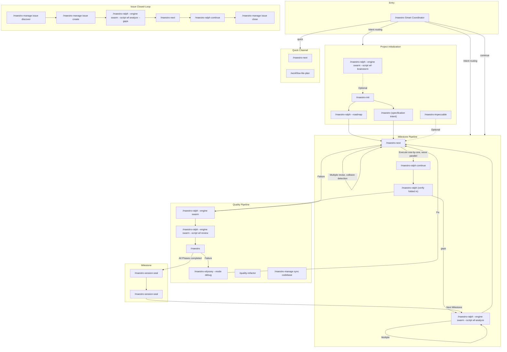
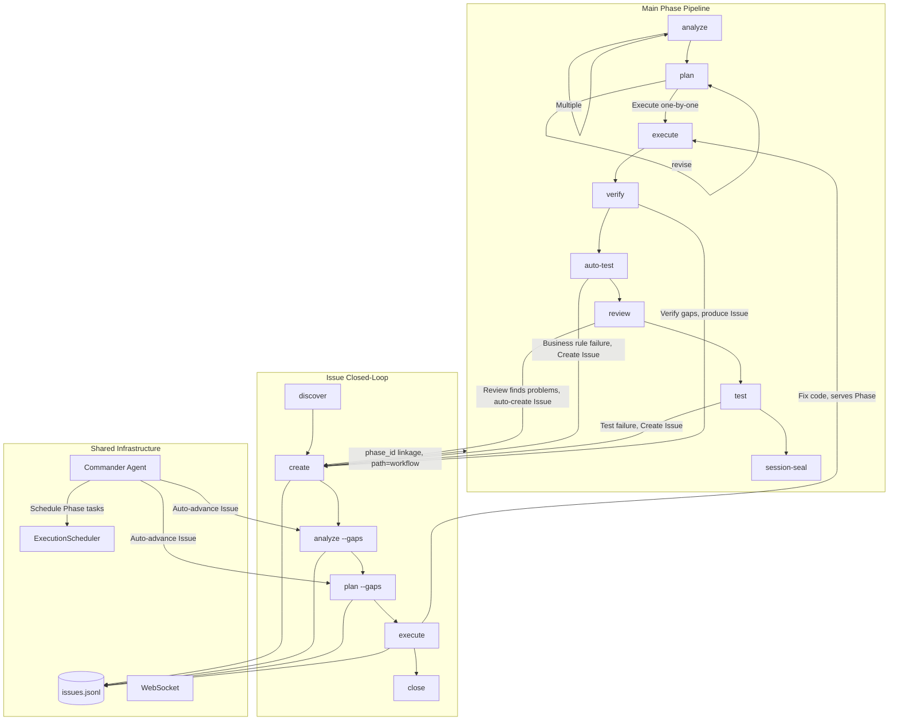

The Maestro command system includes 63 slash commands, organized into 10 major categories. This document provides the command panorama and core workflow navigation.

## Command Overview

| Category | Count | Prefix | Responsibility |
|----------|-------|--------|----------------|
| **Core Workflow** | 19 | `maestro-*` | Lifecycle engine (ralph), initialization, planning, execution, verification, coordination, milestones, overlays |
| **Management** | 13 | `manage-*` | Issue lifecycle, codebase documentation, knowledge capture, memory, harvest, status |
| **Quality** | 9 | `quality-*` | Code review, business testing, UAT, debugging, refactoring, retrospective, sync |
| **Odyssey Deep Cycle** | 5 | `odyssey-*` | Long-running exhaustive iteration — debug, improve, planex, review-fix, UI optimization |
| **Specification** | 3 | `spec-*` | Project spec initialization, loading, entry |
| **Learning** | 5 | `learn-*` | Unified retro (git+decision), follow-along, pattern decompose, investigate, second opinion |
| **Wiki** | 2 | `wiki-*` | Connection discovery, knowledge digest |

The global entry point `/maestro` is the smart coordinator that automatically selects the optimal command chain based on user intent and project state.

---

## Command Panorama



---

## Interaction Between Main Pipeline and Issues



### Two Issue Processing Paths

| path | Meaning | Source | Lifecycle |
|------|---------|--------|-----------|
| `standalone` | Independent Issue, not bound to a Phase | Manual creation, `/maestro-manage issue discover`, external import | Independent closed-loop, does not affect Phase progression |
| `workflow` | Phase-linked Issue | `/maestro-ralph --engine swarm --script wf-review` auto-create, `/maestro-ralph --engine swarm` failure, Phase verification output | May block milestone completion |

---

## 1. Main Workflow

### Project Initialization

```
/maestro-init → /maestro-ralph --engine swarm --script wf-analyze → /maestro-ralph --roadmap or /maestro (specification intent)
```

| Step | Command | Purpose | Output |
|------|---------|---------|--------|
| 0 | `/maestro-ralph --engine swarm --script wf-brainstorm` (optional) | Multi-role brainstorming | guidance-specification.md |
| 1 | `/maestro-init` | Initialize .workflow/ directory | state.json, project.md, specs/ |
| 2 | `/maestro-ralph --engine swarm --script wf-analyze "Goals"` | Macro analysis — understand impact scope | context.md + scope_verdict |
| 3a | `/maestro-ralph --roadmap` | Roadmap (when scope_verdict=large) | roadmap.md (Milestone > Phase) |
| 3b | `/maestro "<specification intent>"` | Formal specification (7 stages) | .workflow/blueprint/ |

### Milestone Pipeline

```
/maestro-ralph (analyze→plan→execute→verify loop) → review → test → /maestro-session-seal
```

| Stage | Command | Output | Artifact |
|-------|---------|--------|----------|
| Analyze | `/maestro-ralph --engine swarm --script wf-analyze` | context.md, analysis.md | ANL-{NNN} |
| Plan | `/maestro-next "<planning intent>"` | plan.json + TASK-*.json | PLN-{NNN} |
| Execute | `/maestro-ralph continue` | .summaries/, code changes | EXC-{NNN} |
| Verify | `/maestro-ralph` (decision gate, verify folded in) | verification.json | VRF-{NNN} |
| Audit | `/maestro-session-seal` | audit-report.md | — |
| Complete | `/maestro-session-seal` | archived to milestones/ | — |

**Scope routing**: No args = entire milestone; number = specific phase; text = adhoc/standalone. `--dir` specifies upstream output path directly.

### Five Usage Modes

**A. Full milestone**: `analyze → plan → execute → verify` (one shot, all phases)

**B. Per-phase**: `analyze 1 → plan 1 → execute 1` (each phase independently)

**C. Mixed**: Full analysis + per-phase execution + adhoc mid-stream

**D. Unified planning**: `analyze 1 → analyze 2 → plan → execute` (analyze first, plan once)

**E. Standalone**: `analyze "topic" → plan --dir → execute --dir` (no init/roadmap needed)

---

## 2. Quick Channel

```bash
/maestro-next "Fix login page bug"              # Shortest path
/maestro-next --full "Refactor API layer"       # With plan validation
/maestro-next --discuss "Database migration"    # With decision extraction

# Scratch mode (no init required)
/maestro-ralph --engine swarm --script wf-analyze "Implement JWT auth"   # scope=standalone
/maestro-next "<planning intent>" --dir scratch/20260420-analyze-xxx
/maestro-ralph continue --dir scratch/20260420-plan-xxx

# Lite chain
/workflow-lite-plan "Implement Issue system"     # explore→plan→execute→test
```

---

## 3. Issue Closed-Loop

```
Discover → Create → Analyze → Plan → Execute → Close
```

```bash
/maestro-manage issue discover by-prompt "Check API error handling"
/maestro-manage issue create --title "Memory leak" --severity high
/maestro-ralph --engine swarm --script wf-analyze --gaps ISS-xxx   # Root cause analysis
/maestro-next "<plan --gaps intent>"                             # Solution planning
/maestro-ralph continue                                # Execute fix
/maestro-manage issue close ISS-xxx --resolution "Fixed"
```

**Commander Agent** auto-advances unanalyzed Issues with priority `execute > analyze > plan`.

---

## Odyssey Deep Cycle

> Exhaustive iteration command family — Three philosophy constraints: **Zero residual** / **Exhaustive iteration** / **Improvement is standard**

Unlike the Quality pipeline (fast gate), Odyssey commands are long-running persistent sessions. Each command has a built-in fix→verify→generalize closed loop that iterates until 0 remaining actionable items.

```bash
/maestro-odyssey --mode debug "memory leak issue"               # archaeology→diagnosis→fix→generalize siblings
/maestro-odyssey --mode improve "src/api/"                       # 6-dim audit→round-by-round fix→exhaust all
/maestro-odyssey --mode planex "implement JWT refresh tokens"    # requirement→acceptance criteria→iterate until ALL pass
/maestro-odyssey --mode review "src/auth/"              # deep review→fix all severities→re-review gate
/maestro-odyssey --mode ui "src/components/Dashboard"            # visual survey→divergent exploration→exhaustive polish
```

| Command | Focus | Compared to |
|---------|-------|-------------|
| `maestro-odyssey --mode debug` | Deep debug with archaeology & generalization | vs `quality-debug` (retired, folded into odyssey) |
| `maestro-odyssey --mode improve` | Runtime quality deep improvement | vs `/maestro-ralph --engine swarm --script wf-review` (pass/fail gate) |
| `maestro-odyssey --mode planex` | Requirement-to-delivery exhaustive loop | vs `/maestro-ralph continue` (plan-based) |
| `maestro-odyssey --mode review` | Review + fix + generalize full cycle | vs `/maestro-ralph --engine swarm --script wf-review` (verdict only) |
| `maestro-odyssey --mode ui` | Persistent UI polish session | vs `/maestro-impeccable` (single execution) |

**Shared flags**: `--skip-fix` (analysis only) · `--skip-generalize` (skip generalization) · `-c` (resume session) · `--auto` (automatic mode)

---

## 4. Quality Pipeline

```bash
/maestro-ralph continue → /maestro-ralph (verify decision gate) → /maestro-ralph --engine swarm → /maestro-ralph --engine swarm --script wf-review → /maestro "<test intent>" → /maestro-session-seal
```

| Command | Purpose | Key Parameters |
|---------|---------|----------------|
| `/maestro-ralph --engine swarm {N}` | Smart routing test (spec/gap/code) | `--re-run` `--dry-run` |
| `/maestro-ralph --engine swarm --script wf-review {N}` | Tiered code review | `--level quick\|standard\|deep` |
| `/maestro "<test intent>"` | Session-based UAT | `--auto-fix` |
| `/maestro-odyssey --mode debug` | Hypothesis-driven debugging | `--from-uat {N}` `--parallel` |
| `/quality-refactor` | Technical debt remediation | `[scope]` |

**Fix loop**: `verify gaps → plan --gaps → execute → verify` or `test failure → debug → plan --gaps → execute`

---

## 5. Coordinator Command Chains

```bash
/maestro "Implement user authentication module"  # Intent recognition → auto-select chain
/maestro -y "Add OAuth support"                  # Fully automatic mode
/maestro continue                                # Auto-execute next step
```

| Chain Name | Command Sequence | Use Case |
|------------|------------------|----------|
| `full-lifecycle` | init→analyze→roadmap→...→session-seal | Brand new project |
| `roadmap-driven` | init→roadmap→... | Lightweight roadmap |
| `brainstorm-driven` | brainstorm→init→roadmap→... | Start from brainstorming |
| `analyze-plan-execute` | analyze→plan→execute | Quick execution |
| `quality-loop` | review→test→debug | Quality pipeline |
| `milestone-close` | session-seal | Close a milestone |
| `quick` | next task | Instant small tasks |

---

## 6. Specification and Knowledge

```bash
/maestro-spec setup                                      # Scan project for conventions
/maestro-spec add coding "All APIs use Hono framework"   # Record a spec
/maestro-spec load --role implement                     # Load specs
/maestro-manage sync codebase                            # Incremental refresh codebase docs
/maestro-manage knowledge knowhow search "authentication"  # Search knowhow
/maestro-manage status                                   # Project dashboard
```

---

## Specialized Guides

| Topic | Guide |
|-------|-------|
| Quality pipeline details | [Quality Pipeline Guide](./quality-pipeline-guide.md) |
| Issue discovery & closed-loop | [Issue Discover Guide](./issue-discover-guide.md) |
| Learning toolkit | [Learn Tools Guide](./learn-tools-guide.md) |
| Knowledge graph management | [Knowledge Management Guide](./knowledge-management-guide.md) |
| CLI command reference | [CLI Commands Guide](./cli-commands-guide.md) |
| Spec system | [Spec System Guide](./spec-system-guide.md) |
| Spec injection mechanism | [Spec Injection Guide](./spec-injection-guide.md) |
| MCP tools reference | [MCP Tools Guide](./mcp-tools-guide.md) |
| Delegate async tasks | [Delegate Async Guide](./delegate-async-guide.md) |
| Overlay command extension | [Overlay Guide](./overlay-guide.md) |
| Hooks automation | [Hooks Guide](./hooks-guide.md) |
