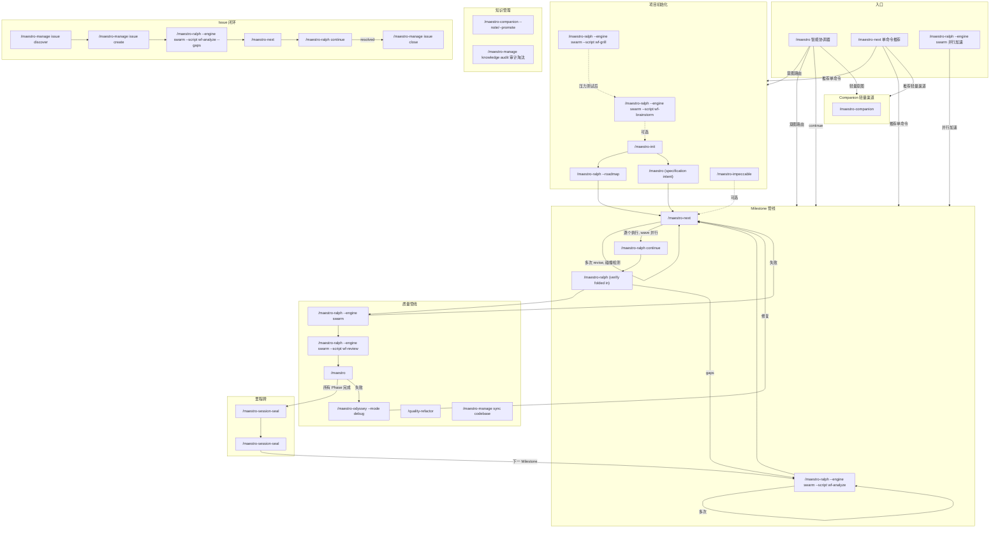
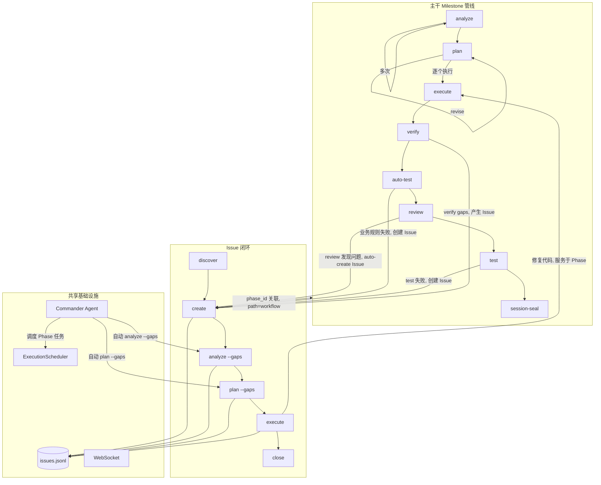

Maestro 命令系统包含 63 个 slash 命令，分为 10 大类。本文档提供命令全景图和核心工作流导航。

## 命令总览

| 类别 | 命令数 | 前缀 | 职责 |
|------|--------|------|------|
| **核心工作流** | 19 | `maestro-*` | 项目初始化、规划、执行、验证、coordinate、milestones、overlays、swarm、companion、next |
| **管理** | 13 | `manage-*` | Issue 生命周期、代码库文档、知识捕获、记忆管理、harvest、status、knowledge-audit |
| **质量** | 9 | `quality-*` | 代码审查、业务测试、UAT、调试、重构、复盘、同步 |
| **Odyssey 深度循环** | 5 | `odyssey-*` | 长周期穷尽迭代——调试、改进、需求交付、审查修复、UI 优化 |
| **规范** | 3 | `spec-*` | 项目规范初始化、加载、录入 |
| **学习** | 5 | `learn-*` | 统一复盘（git+决策）、跟读学习、模式拆解、系统探究、多视角分析 |
| **知识图谱** | 2 | `wiki-*` | 连接发现、知识摘要 |
| **团队智能** | 1 | `team-*` | ACO 蚁群智能、群体优化 |

全局入口 `/maestro` 是智能协调器，根据用户意图和项目状态自动选择最优命令链。

---

## 命令全景图



---

## 主干与 Issue 的交互关系



### Issue 两种处理路径

| path | 含义 | 来源 | 生命周期 |
|------|------|------|----------|
| `standalone` | 独立 Issue，不绑定 Phase | 手动创建、`/maestro-manage issue discover`、外部导入 | 独立闭环，不影响 Phase 推进 |
| `workflow` | Phase 关联 Issue | `/maestro-ralph --engine swarm --script wf-review` auto-create、`/maestro-ralph --engine swarm` 失败产生、Phase 验证产生 | 可能阻塞 milestone 完成 |

---

## 一、主干工作流

### 项目初始化

```
/maestro-init → /maestro-ralph --engine swarm --script wf-analyze → /maestro-ralph --roadmap 或 /maestro (specification intent)
```

| 步骤 | 命令 | 作用 | 产出 |
|------|------|------|------|
| 0 | `/maestro-ralph --engine swarm --script wf-brainstorm` (可选) | 多角色头脑风暴 | guidance-specification.md |
| 1 | `/maestro-init` | 初始化 .workflow/ 目录 | state.json, project.md, specs/ |
| 2 | `/maestro-ralph --engine swarm --script wf-analyze "目标"` | 宏观分析——理解影响面 | context.md + scope_verdict |
| 3a | `/maestro-ralph --roadmap` | 路线图（scope_verdict=large 时） | roadmap.md (Milestone > Phase) |
| 3b | `/maestro "<specification intent>"` | 正式规格文档（7 阶段） | .workflow/blueprint/ |

### Milestone 管线

```
/maestro-ralph (analyze→plan→execute→verify loop) → review → test → /maestro-session-seal
```

| 阶段 | 命令 | 产出 | Artifact |
|------|------|------|----------|
| 分析 | `/maestro-ralph --engine swarm --script wf-analyze` | context.md, analysis.md | ANL-{NNN} |
| 规划 | `/maestro-next "<planning intent>"` | plan.json + TASK-*.json | PLN-{NNN} |
| 执行 | `/maestro-ralph continue` | .summaries/, 代码变更 | EXC-{NNN} |
| 验证 | `/maestro-ralph`（决策门，verify 已内聚） | verification.json | VRF-{NNN} |
| 审计 | `/maestro-session-seal` | audit-report.md | — |
| 完成 | `/maestro-session-seal` | 归档到 milestones/ | — |

**Scope 路由**：无参数 = milestone 全量；数字 = 指定 phase；文本 = adhoc/standalone。`--dir` 直接指定上游产物路径。

### 五种使用模式

**A. 全量模式**：`analyze → plan → execute → verify`（一步覆盖所有 phase）

**B. 逐 Phase**：`analyze 1 → plan 1 → execute 1`（每个 phase 独立）

**C. 混合模式**：全量分析 + 逐 phase 执行 + 中途 adhoc

**D. 统一规划**：`analyze 1 → analyze 2 → plan → execute`（分析后统一规划）

**E. 独立模式**：`analyze "topic" → plan --dir → execute --dir`（无需 init/roadmap）

---

## 二、快速渠道

```bash
/maestro-next "修复登录页面 bug"              # 最短路径
/maestro-next --full "重构 API 层"            # 带规划验证
/maestro-next --discuss "数据库迁移方案"       # 带决策提取

# Scratch 模式（无需 init）
/maestro-ralph --engine swarm --script wf-analyze "实现 JWT 认证"   # scope=standalone
/maestro-next "<planning intent>" --dir scratch/20260420-analyze-xxx
/maestro-ralph continue --dir scratch/20260420-plan-xxx

# Lite 链
/workflow-lite-plan "实现 Issue 闭环系统"      # 探索→规划→执行→测试
```

---

## 三、Issue 闭环

```
发现 → 创建 → 分析 → 规划 → 执行 → 关闭
```

```bash
/maestro-manage issue discover by-prompt "检查 API 的错误处理"
/maestro-manage issue create --title "内存泄漏" --severity high
/maestro-ralph --engine swarm --script wf-analyze --gaps ISS-xxx   # 根因分析
/maestro-next "<plan --gaps intent>"                            # 方案规划
/maestro-ralph continue                                # 执行修复
/maestro-manage issue close ISS-xxx --resolution "Fixed"
```

**Commander Agent** 可自动推进未分析的 Issue，按 `execute > analyze > plan` 优先级调度。

---

## Odyssey 深度循环

> 穷尽迭代命令族——三句哲学约束：**零遗留** / **穷尽迭代** / **改进即标准**

与 Quality 管线（快速门控）不同，Odyssey 命令是长周期持久化会话，每个命令自带 fix→verify→generalize 闭环迭代，直到 0 remaining actionable 才退出。

```bash
/maestro-odyssey --mode debug "内存泄漏问题"                    # 考古→诊断→修复→泛化同类
/maestro-odyssey --mode improve "src/api/"                      # 6 维审计→逐轮修复→全部穷尽
/maestro-odyssey --mode planex "实现 JWT 刷新令牌"               # 需求→验收标准→迭代直到 ALL pass
/maestro-odyssey --mode review "src/auth/"             # 深度审查→全 severity 修复→re-review
/maestro-odyssey --mode ui "src/components/Dashboard"           # 视觉普查→发散探索→穷尽打磨
```

| 命令 | 定位 | 对比 |
|------|------|------|
| `maestro-odyssey --mode debug` | 深度调试闭环（含考古、泛化） | vs `/quality-debug`（已退役，并入 odyssey） |
| `maestro-odyssey --mode improve` | 运行质量深度提升 | vs `/maestro-ralph --engine swarm --script wf-review`（通过/失败门控） |
| `maestro-odyssey --mode planex` | 需求到交付穷尽迭代 | vs `/maestro-ralph continue`（按计划执行） |
| `maestro-odyssey --mode review` | 审查+修复+泛化全流程 | vs `/maestro-ralph --engine swarm --script wf-review`（裁决不修复） |
| `maestro-odyssey --mode ui` | UI 持久化打磨会话 | vs `/maestro-impeccable`（单次执行） |

**共用 flags**：`--skip-fix`（仅分析）· `--skip-generalize`（跳过泛化）· `-c`（恢复会话）· `--auto`（自动模式）

---

## 四、质量管线

```bash
/maestro-ralph continue → /maestro-ralph (verify 决策门) → /maestro-ralph --engine swarm → /maestro-ralph --engine swarm --script wf-review → /maestro "<test intent>" → /maestro-session-seal
```

| 命令 | 用途 | 关键参数 |
|------|------|----------|
| `/maestro-ralph --engine swarm {N}` | 智能路由测试（spec/gap/code） | `--re-run` `--dry-run` |
| `/maestro-ralph --engine swarm --script wf-review {N}` | 分层代码审查 | `--level quick\|standard\|deep` |
| `/maestro "<test intent>"` | 会话式 UAT | `--auto-fix` |
| `/maestro-odyssey --mode debug` | 假设驱动调试 | `--from-uat {N}` `--parallel` |
| `/quality-refactor` | 技术债务治理 | `[scope]` |

**修复循环**：`verify gaps → plan --gaps → execute → verify` 或 `test 失败 → debug → plan --gaps → execute`

---

## 五、协调器命令链

```bash
/maestro "实现用户认证模块"          # 意图识别 → 自动选择命令链
/maestro -y "添加 OAuth 支持"        # 全自动模式
/maestro continue                    # 自动执行下一步
```

| 链名 | 命令序列 | 适用场景 |
|------|----------|----------|
| `full-lifecycle` | init→analyze→roadmap→...→session-seal | 全新项目 |
| `roadmap-driven` | init→roadmap→... | 轻量路线图 |
| `brainstorm-driven` | brainstorm→init→roadmap→... | 从头脑风暴开始 |
| `analyze-plan-execute` | analyze→plan→execute | 需要规划的多步交付 |
| `quality-loop` | review→test→debug | 质量流水线 |
| `milestone-close` | session-seal | 关闭里程碑 |
| `companion` | `/maestro-companion "<intent>"` | 即时小任务 |

---

## 六、规范与知识

> **路由边界**（v0.5.50+）：`/maestro-spec` 管理项目约束规则（编码规范、架构约束、质量标准）；`/maestro-manage knowledge` 管理可复用知识文档（决策记录、操作配方、参考资料）。约束类走 `/maestro-spec add`，知识类走 `/maestro-manage knowhow capture`。

```bash
/maestro-spec setup                                      # 扫描项目生成规范
/maestro-spec add coding "所有 API 使用 Hono 框架"       # 录入约束规则
/maestro-spec load --role implement                     # 加载规范
/maestro-manage sync codebase                            # 增量刷新代码库文档
/maestro-manage knowledge knowhow search "认证"          # 搜索可复用知识
/maestro-manage knowledge audit --scope all             # 审计三存储，清理过期/矛盾条目
/maestro-manage status                                   # 项目仪表板
/maestro-next --note "实现认证"      # 任务前加载知识上下文（或用 maestro search/load）
```

### 新增命令速查

| 命令 | 定位 | 使用场景 |
|------|------|----------|
| `/maestro-ralph --engine swarm` | 并行加速层 | 8 个 Workflow 脚本覆盖 analyze/brainstorm/review/verify/grill/plan/execute/milestone-audit |
| `/maestro-next --note/--promote` | 知识伴侣 | note（记录洞察）→ promote（沉淀知识）→ 推荐下一步 |
| `/maestro-next` | 单命令推荐 | 轻量路由，不创建 session，推荐 1 个原子命令 + 2-3 备选 |
| `/maestro-ralph --engine swarm --script wf-grill` | 压力测试 | 对抗式苏格拉底访谈，验证方案假设，产出 context-package |
| `/maestro "<specification intent>"` | 正式规格 | 6 阶段文档链（Brief → PRD → Architecture → Epics），与 brainstorm 互补 |
| `/maestro-manage knowledge audit` | 知识审计 | spec/knowhow/artifact 三存储审计淘汰（keep/deprecate/delete） |
| `/team-swarm` | 蚁群智能 | ACO 驱动群体优化，信息素收敛，4 角色 + Python 控制器 |
| `/maestro-odyssey --mode debug` | 深度调试 | 考古→诊断→修复→泛化，三句哲学约束穷尽迭代 |
| `/maestro-odyssey --mode improve` | 深度改进 | 6 维审计→逐轮修复→0 remaining actionable |
| `/maestro-odyssey --mode planex` | 需求交付 | 验收标准 ALL pass，不允许"接近通过" |
| `/maestro-odyssey --mode review` | 审查修复 | 全 severity 逐轮修复 + re-review gate |
| `/maestro-odyssey --mode ui` | UI 深度优化 | 视觉普查→发散探索→穷尽打磨每个像素 |

---

## 专题指南

| 专题 | 指南 |
|------|------|
| 质量管线详细说明 | [Quality Pipeline Guide](./quality-pipeline-guide.md) |
| Issue 发现与闭环 | [Issue Discover Guide](./issue-discover-guide.md) |
| 学习工具集 | [Learn Tools Guide](./learn-tools-guide.md) |
| 知识图谱管理 | [Knowledge Management Guide](./knowledge-management-guide.md) |
| CLI 命令参考 | [CLI Commands Guide](./cli-commands-guide.md) |
| Spec 规范系统 | [Spec System Guide](./spec-system-guide.md) |
| Spec 注入机制 | [Spec Injection Guide](./spec-injection-guide.md) |
| MCP 工具参考 | [MCP Tools Guide](./mcp-tools-guide.md) |
| Delegate 异步委托 | [Delegate Async Guide](./delegate-async-guide.md) |
| Overlay 命令扩展 | [Overlay Guide](./overlay-guide.md) |
| Hooks 自动化 | [Hooks Guide](./hooks-guide.md) |

---

## 附录：辅助命令

工作流中用于维护、发布和规范管理的辅助命令。

### maestro-overlay --amend — 增量修改

信号驱动的 Overlay 生成器。从多种来源收集工作流缺陷信号，诊断哪些命令需要补充修改，批量生成针对性的 Overlay 补丁。所有修改通过 Overlay 系统（`~/.maestro/overlays/*.json`）完成——不侵入原始命令文件，幂等且重装后保留。

与 `/maestro-overlay`（单次显式创建）不同，`/maestro-overlay --amend` 通过分析工作流产物自动**发现**需要修复的内容。

#### 信号来源

| 标志 | 来源 | 采集内容 |
|------|------|---------|
| `--from-verify <dir>` | verification.json | 验证失败暴露的工作流缺口 |
| `--from-review <dir>` | review.json | 代码审查发现的流程缺陷 |
| `--from-session <id>` | 会话产物 | 执行期间遇到的问题 |
| `--from-issues ISS-xxx,...` | issues.jsonl | 追溯到命令缺陷的 Issue |
| `--scan` | 自动扫描 .workflow/ | 发现所有工作流相关信号 |
| _(位置参数文本)_ | 用户描述 | 直接观察和说明 |

```bash
/maestro-overlay --amend --from-verify .workflow/phases/1    # 从验证结果中发现命令缺口
/maestro-overlay --amend --scan                               # 自动扫描所有信号
/maestro-overlay --amend "maestro-ralph continue 缺少 CLI 编译验证步骤"  # 直接描述问题
```

### maestro-update — 更新检查

检测当前 `.workflow/` 的 schema 版本，展示可用迁移计划，交互式执行版本升级。支持增量链式升级（如 1.0 → 2.0 → 3.0）。

```bash
/maestro-update --dry-run   # 检查是否有待执行的迁移
/maestro-update             # 交互式逐步升级
/maestro-update --force     # 一键全量升级
```

### maestro-spec remove — 规范移除

从 specs 文件中移除指定的 `<spec-entry>` 条目。Entry ID 格式：`spec-{file-stem}-{NNN}`。

```bash
maestro wiki list --type spec --json    # 列出所有 spec 条目
/maestro-spec remove spec-learnings-003          # 移除指定条目
```

### maestro-manage knowledge audit — 知识审计

审计 spec / knowhow / artifact 三存储，识别矛盾、过期、孤立和元数据质量问题。

| 标志 | 说明 |
|------|------|
| `--scope <spec\|knowhow\|artifact\|all>` | 审计范围（必需） |
| `--level P0\|P1\|P2` | 严重级别过滤 |
| `--dry-run` | 预览不修改 |
| `--report` | 仅生成审计报告 |

```bash
/maestro-manage knowledge audit --scope all              # 全量审计
/maestro-manage knowledge audit --scope spec --level P0  # 仅 P0 级 spec 问题
```

### 里程碑发布（/maestro-milestone-release 已退役）

> `/maestro-milestone-release` 已退役（v0.5.51）。发布请直接使用 npm CLI 执行 semver 版本提升与 git tag，或使用 `/maestro-update` 检查迁移。

```bash
npm version minor && git tag                  # 标准发布（minor 递增）
npm version patch && git tag                  # 补丁版本
npm version 2.0.0 && git tag v2.0.0            # 显式版本号
npm version --dry-run                          # 仅预览
```

里程碑生命周期：`/maestro-session-seal → 发布（npm version + tag / /maestro-update）`
