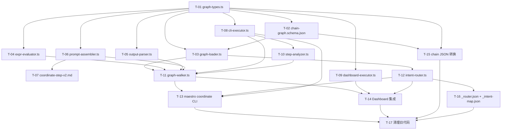

# Graph Coordinator 整合实施计划

> 整合来源：设计文档 (`docs/graph-coordinator-design.md` Section 14) + Gemini 分析 (12 任务 5 波)

---

## 实施总览

6 个 Phase，17 个 Task，按依赖拓扑排列。每个 Task 标注复杂度 (S/M/L/XL)、预期产物、验收标准。

```
Phase 1: 类型 + Schema + 加载器           ← 零运行时依赖，纯基础设施
Phase 2: 表达式引擎 + 输出解析            ← 两个独立模块可并行
Phase 3: Prompt 组装 + Executor 接口      ← 桥接 walker ↔ 外部
Phase 4: Walker 引擎 + Intent 路由        ← 核心状态机
Phase 5: 双端点集成 (CLI + Dashboard)     ← 接入真实环境
Phase 6: 图文件迁移 + 清理               ← 替换旧代码
```

### 依赖 DAG



---

## Phase 1: 类型 + Schema + 加载器

### T-01: graph-types.ts — 纯类型定义

| 属性 | 值 |
|------|-----|
| 复杂度 | M |
| 文件 | `src/coordinator/graph-types.ts` (new) |
| 依赖 | None |

**产物**: 所有接口定义
- `ChainGraph`, `GraphInput`
- 7 种 Node 类型: `CommandNode`, `DecisionNode`, `GateNode`, `ForkNode`, `JoinNode`, `EvalNode`, `TerminalNode`
- `GraphNode` 联合类型
- `DecisionEdge`, `ExtractionRule`
- `WalkerState`, `WalkerContext`, `HistoryEntry`, `ForkBranchState`, `DelegateFrame`
- `CommandExecutor`, `ExecuteRequest`, `ExecuteResult` 接口
- `PromptAssembler`, `AssembleRequest` 接口
- `ExprEvaluator` 接口
- `CoordinateEvent` 事件联合类型

**验收**:
- [ ] 所有接口与设计文档 Section 4/8/9/10/11 一致
- [ ] 零运行时代码，纯 type export
- [ ] `npm run build` 通过

### T-02: chain-graph.schema.json — Graph JSON Schema

| 属性 | 值 |
|------|-----|
| 复杂度 | S |
| 文件 | `src/coordinator/chain-graph.schema.json` (new) |
| 依赖 | T-01 |

**产物**: JSON Schema draft-07，校验 `~/.maestro/chains/*.json` 格式
- 覆盖 `ChainGraph` envelope: id, name, version, entry, nodes, defaults, inputs
- 覆盖 7 种 node 类型的 discriminated union (`type` 字段)
- `required` / `additionalProperties` 约束

**验收**:
- [ ] 能校验设计文档中 quality-loop.json、full-lifecycle.json、singles/plan.json 三个示例
- [ ] 拒绝缺少 `entry` / 无效 `type` 的 JSON

### T-03: graph-loader.ts — 图加载/校验/缓存

| 属性 | 值 |
|------|-----|
| 复杂度 | M |
| 文件 | `src/coordinator/graph-loader.ts` (new), `src/coordinator/__tests__/graph-loader.test.ts` (new) |
| 依赖 | T-01, T-02 |

**产物**: `GraphLoader` 类
- `load(graphId: string): Promise<ChainGraph>` — 从 `~/.maestro/chains/` 读取 JSON
- `loadSync(graphId: string): ChainGraph` — 同步版本 (for _router)
- JSON Schema 校验 (ajv)
- LRU 缓存 + file mtime 失效
- `listAll(): string[]` — 枚举可用图

**验收**:
- [ ] 加载有效 JSON 返回 ChainGraph
- [ ] 无效 JSON 抛 `GraphValidationError`
- [ ] 缓存命中第二次不读磁盘
- [ ] 文件变更后缓存失效

---

## Phase 2: 表达式引擎 + 输出解析 (可并行)

### T-04: expr-evaluator.ts — 表达式解析 & 求值

| 属性 | 值 |
|------|-----|
| 复杂度 | L |
| 文件 | `src/coordinator/expr-evaluator.ts` (new), `src/coordinator/__tests__/expr-evaluator.test.ts` (new) |
| 依赖 | T-01 |

**产物**: `ExprEvaluator` 实现
- Tokenizer: 标识符、字符串、数字、布尔、null、运算符 (`==`, `!=`, `>`, `>=`, `<`, `<=`, `&&`, `||`, `!`)
- Recursive descent parser → AST
- `resolve(expr, ctx)`: 路径求值 (`ctx.result.status` → 实际值)
- `evaluate(expr, ctx)`: 条件求值 → boolean
- `match(edge, resolvedValue, ctx)`: DecisionEdge 匹配 (value/match/label/default 优先级)

**不用 `eval()`，不用 `new Function()`**

**验收**:
- [ ] `resolve("ctx.result.verification_status", ctx)` → `"passed"`
- [ ] `evaluate("score >= 80 && issues == 0", ctx)` → `true/false`
- [ ] `resolve("ctx.visits.verify", ctx)` → 数字
- [ ] 无效表达式抛 `ExprSyntaxError`
- [ ] 不存在路径返回 `undefined` (不抛异常)

### T-05: output-parser.ts — COORDINATE RESULT 解析

| 属性 | 值 |
|------|-----|
| 复杂度 | M |
| 文件 | `src/coordinator/output-parser.ts` (new), `src/coordinator/__tests__/output-parser.test.ts` (new) |
| 依赖 | T-01 |

**产物**: `OutputParser` 类
- `parse(rawOutput: string, node: CommandNode): ParsedResult`
  1. 从 raw output 中提取 `--- COORDINATE RESULT ---` block (7 字段)
  2. 应用 node 的 `extract` 规则 (regex / json_path / line_match)
  3. 返回 `ParsedResult.structured`

**ParsedResult.structured 字段**:
```typescript
{
  status: 'SUCCESS' | 'FAILURE';
  phase: string | null;
  verification_status: string | null;
  review_verdict: string | null;
  uat_status: string | null;
  artifacts: string[];
  summary: string;
  [key: string]: unknown;  // from extract rules
}
```

**验收**:
- [ ] 解析完整 7 字段 RESULT block
- [ ] 解析部分字段 (缺失的为 null)
- [ ] 无 RESULT block 时返回 `{ status: 'FAILURE', summary: 'No COORDINATE RESULT block found' }`
- [ ] extract regex 规则能提取 phase、spec_session_id 等
- [ ] extract line_match 规则能提取 scratch_dir

---

## Phase 3: Prompt 组装 + Executor 接口

### T-06: prompt-assembler.ts — 6 阶段 Prompt 管线

| 属性 | 值 |
|------|-----|
| 复杂度 | L |
| 文件 | `src/coordinator/prompt-assembler.ts` (new), `src/coordinator/__tests__/prompt-assembler.test.ts` (new) |
| 依赖 | T-01 |

**产物**: `DefaultPromptAssembler` 实现 (设计文档 Section 9.4)

6 阶段:
1. **Resolve Args** — `{phase}` → ctx.inputs.phase, `{var.xxx}` → ctx.var.xxx
2. **Build Command Block** — `/{cmd} {resolved_args} {auto_flag}`
3. **Inject Previous Context** — ctx.result + ctx.analysis.next_step_hints + cautions
4. **Inject State Snapshot** — ctx.project 摘要
5. **Apply Template** — 加载 coordinate-step-v2.md，填充占位符
6. **Auto Directive** — auto 模式注入

**验收**:
- [ ] Phase 1: `{phase}` 替换为 `"3"`, `{var.scratch_dir}` 替换为实际路径
- [ ] Phase 3: 上步 result.summary + analysis.next_step_hints 出现在 prompt 中
- [ ] Phase 4: 项目状态摘要出现在 prompt 中
- [ ] Phase 6: auto_mode=true 时包含 auto directive
- [ ] 完整 prompt 符合 coordinate-step-v2 模板结构

### T-07: coordinate-step-v2.md — 新模板

| 属性 | 值 |
|------|-----|
| 复杂度 | S |
| 文件 | `templates/cli/prompts/coordinate-step-v2.md` (new) |
| 依赖 | T-06 |

**产物**: Mustache 风格模板 (设计文档 Section 9.5)
- `{{COMMAND}}`, `{{STEP_N}}`, `{{GRAPH_NAME}}`
- `{{#PREVIOUS_CONTEXT}}...{{/PREVIOUS_CONTEXT}}` 条件块
- `{{#STATE_SNAPSHOT}}...{{/STATE_SNAPSHOT}}`
- `{{#AUTO_DIRECTIVE}}...{{/AUTO_DIRECTIVE}}`
- 扩展的 7 字段 COORDINATE RESULT 格式说明

### T-08: cli-executor.ts — CLI 端 CommandExecutor

| 属性 | 值 |
|------|-----|
| 复杂度 | M |
| 文件 | `src/coordinator/cli-executor.ts` (new) |
| 依赖 | T-01 |

**产物**: `CliExecutor` 实现 `CommandExecutor` 接口
- 复用 `CliAgentRunner` 的 `createAdapter()` 工厂
- 同步等待 agent 完成
- 返回 `ExecuteResult` (success, raw_output, exec_id, duration_ms)

**验收**:
- [ ] 能 spawn claude/gemini/qwen adapter
- [ ] 正确等待完成并收集输出
- [ ] abort() 能终止正在运行的 agent

### T-09: dashboard-executor.ts — Dashboard 端 CommandExecutor

| 属性 | 值 |
|------|-----|
| 复杂度 | M |
| 文件 | `dashboard/src/server/coordinator/dashboard-executor.ts` (new) |
| 依赖 | T-01 |

**产物**: `DashboardExecutor` 实现 `CommandExecutor` 接口
- 使用 `AgentManager.spawn()` 启动 agent
- 事件驱动等待 `agent:stopped` 事件
- 超时保护

### T-10: step-analyzer.ts — Gemini 步后分析

| 属性 | 值 |
|------|-----|
| 复杂度 | M |
| 文件 | `src/coordinator/step-analyzer.ts` (new) |
| 依赖 | T-08 |

**产物**: `StepAnalyzer` 类 (可选模块)
- `analyze(node, rawOutput, ctx, prevCmd): Promise<AnalysisResult>`
- 调用 gemini 分析上步输出
- 返回 `{ quality_score, issues[], next_step_hints: { prompt_additions, cautions, context_to_carry } }`
- 结果存储到 `outputs/{node_id}.analysis.json`

---

## Phase 4: Walker 引擎 + Intent 路由

### T-11: graph-walker.ts — 核心状态机

| 属性 | 值 |
|------|-----|
| 复杂度 | XL |
| 文件 | `src/coordinator/graph-walker.ts` (new), `src/coordinator/__tests__/graph-walker.test.ts` (new) |
| 依赖 | T-03, T-04, T-05, T-06, T-08, T-10 |

**产物**: `GraphWalker` 类 (设计文档 Section 10)

构造函数注入 (DI):
```typescript
constructor(
  loader: GraphLoader,
  assembler: PromptAssembler,
  executor: CommandExecutor,
  analyzer: StepAnalyzer | null,
  outputParser: OutputParser,
  evaluator: ExprEvaluator,
  emitter?: WalkerEventEmitter,
)
```

主循环 `walk(state, graph)`:
- `command` — assembler.assemble() → executor.execute() → outputParser.parse() → analyzer.analyze()
- `decision` — evaluator.resolve() → edge 匹配 (value > match > label > default)
- `gate` — evaluator.evaluate() → on_pass / on_fail / wait
- `eval` — 批量 set context
- `fork` — 并行 launch (Phase 5 才完整实现，先 sequential fallback)
- `join` — merge 策略 (all/any/majority)
- `terminal` — success/failure/paused/delegate (delegate_stack push + graph switch)

额外方法:
- `start(graphId, intent, options)` — 初始化 session + 开始 walk
- `resume(sessionId?)` — 从 walker-state.json 恢复
- `stop()` — abort executor + save state
- `runSync(state, graph)` — 同步版 (for _router.json 纯 decision 图)

持久化:
- 每个 node 退出时 save `walker-state.json`
- 事件写入 `events.ndjson`

**验收**:
- [ ] Mock executor — quality-loop 图: verify→check_verify→review→test→done (happy path)
- [ ] Mock executor — quality-loop 图: verify fail → plan_gaps → re_execute → verify (loop path)
- [ ] max_visits 触发 → 走 on_failure 或 _fail
- [ ] delegate terminal → graph switch + stack push
- [ ] resume 从 walker-state.json 恢复到中断点
- [ ] 事件正确 emit (walker:node_enter, walker:node_exit, walker:decision, walker:completed)

### T-12: intent-router.ts — Intent → Graph ID

| 属性 | 值 |
|------|-----|
| 复杂度 | M |
| 文件 | `src/coordinator/intent-router.ts` (new), `src/coordinator/__tests__/intent-router.test.ts` (new) |
| 依赖 | T-03 |

**产物**: `IntentRouter` 类
- 加载 `~/.maestro/chains/_intent-map.json`
- `resolve(intent: string, forceGraph?: string): string`
  1. `forceGraph` 直接返回
  2. 顺序匹配 `patterns[].regex`
  3. `route.graph` → 直接返回 graph ID
  4. `route.strategy === 'state_router'` → 加载 `_router.json`，用 `walker.runSync()` 走到 terminal.delegate_graph
  5. 无匹配 → fallback graph

**验收**:
- [ ] "brainstorm a feature" → `brainstorm-driven`
- [ ] "continue" → state_router 策略
- [ ] "status" → `singles/status`
- [ ] 未知 intent → fallback `singles/quick`

---

## Phase 5: 双端点集成

### T-13: `maestro coordinate` CLI 命令

| 属性 | 值 |
|------|-----|
| 复杂度 | L |
| 文件 | `src/commands/coordinate.ts` (new), `src/cli.ts` (modify) |
| 依赖 | T-11, T-12, T-08 |

**产物**: `maestro coordinate [intent]` 命令 (设计文档 Section 8.6)
- Options: `-y`, `-c [sessionId]`, `--chain <name>`, `--tool <tool>`, `--dry-run`
- 组装: GraphLoader + IntentRouter + DefaultPromptAssembler + CliExecutor + GraphWalker
- `--dry-run`: 不执行 command，只打印 traversal plan
- 注册到 `src/cli.ts`

**验收**:
- [ ] `maestro coordinate "implement auth" -y --tool claude` → 正确路由到图并开始执行
- [ ] `maestro coordinate -c` → resume 最近 session
- [ ] `maestro coordinate --chain quality-loop` → 强制使用指定图
- [ ] `maestro coordinate --dry-run "review code"` → 打印图结构，不执行

### T-14: Dashboard 集成

| 属性 | 值 |
|------|-----|
| 复杂度 | L |
| 文件 | `dashboard/src/server/coordinator/workflow-coordinator.ts` (modify), `dashboard/src/server/ws/handlers/coordinate-handler.ts` (modify), `dashboard/src/shared/coordinate-types.ts` (modify) |
| 依赖 | T-11, T-09, T-12 |

**产物**: Dashboard WorkflowCoordinator 改为 thin wrapper over GraphWalker
- 保留 WebSocket API 向后兼容 (`coordinate:start`, `coordinate:stop`, `coordinate:resume`)
- 内部替换为 GraphWalker + DashboardExecutor
- Walker 事件 → SSE 推送
- 更新 `coordinate-types.ts` 新增 graph-aware 字段

**风险缓解**: Feature flag `USE_GRAPH_WALKER` (env var)，false 时走旧逻辑

**验收**:
- [ ] `coordinate:start { intent, autoMode, tool }` → GraphWalker 启动
- [ ] Walker 事件正确通过 SSE 推送到前端
- [ ] `coordinate:stop` → walker.stop() + executor.abort()
- [ ] Feature flag off → 旧 CoordinateRunner 逻辑不受影响

---

## Phase 6: 图文件迁移 + 清理

### T-15: Chain → Graph JSON 转换

| 属性 | 值 |
|------|-----|
| 复杂度 | M |
| 文件 | `~/.maestro/chains/*.json` (new, ~15 files) |
| 依赖 | T-02, T-01 |

**产物**: 将 `chain-map.ts` 中所有链转为图 JSON
- 多步图: `full-lifecycle.json`, `spec-driven.json`, `brainstorm-driven.json`, `roadmap-driven.json`, `ui-design-driven.json`, `execute-verify.json`, `quality-loop.json`, `milestone-close.json`, `analyze-plan-execute.json`
- 单步图: `singles/init.json`, `singles/plan.json`, `singles/execute.json`, `singles/verify.json`, `singles/review.json`, `singles/debug.json`, `singles/test.json`, `singles/quick.json`, `singles/status.json`, `singles/analyze.json`, `singles/phase-transition.json`

**验收**:
- [ ] 所有 JSON 通过 chain-graph.schema.json 校验
- [ ] GraphLoader.load() 能正确加载每个文件
- [ ] 多步图的决策边覆盖了原 chainMap 的所有路径

### T-16: _router.json + _intent-map.json

| 属性 | 值 |
|------|-----|
| 复杂度 | M |
| 文件 | `~/.maestro/chains/_router.json` (new), `~/.maestro/chains/_intent-map.json` (new) |
| 依赖 | T-12 |

**产物**:
- `_router.json` — 设计文档 Section 6 的完整状态路由图 (替代 `detectNextAction`)
- `_intent-map.json` — 设计文档 Section 5 的 intent 映射表 (替代 `INTENT_PATTERNS` + `TASK_TO_CHAIN`)

**验收**:
- [ ] `_router.json` 覆盖所有 `detectNextAction` 分支 (pending/exploring/planning/executing/verifying/testing/completed/blocked)
- [ ] `_intent-map.json` 覆盖所有 `INTENT_PATTERNS` regex

### T-17: 清理旧代码

| 属性 | 值 |
|------|-----|
| 复杂度 | S |
| 文件 | 多文件删除/修改 |
| 依赖 | T-13, T-14, T-15, T-16 |

**产物**:
- 删除 `dashboard/src/server/coordinator/coordinate-runner.ts`
- 删除 `chain-map.ts` 中的 `CHAIN_MAP`, `INTENT_PATTERNS`, `TASK_TO_CHAIN`
- 删除 `templates/cli/prompts/coordinate-step.txt` (被 v2 替代)
- 更新 workflow `maestro-coordinate.md` 指向新的 `maestro coordinate` 命令
- 移除 feature flag

---

## 风险矩阵

| 风险 | 概率 | 影响 | 缓解策略 |
|------|------|------|----------|
| **WebSocket API 破坏** | 中 | 高 | Feature flag `USE_GRAPH_WALKER`，false 时走旧逻辑 |
| **表达式解析器 bug** | 中 | 中 | 最小语言集 + 强覆盖单测，不支持嵌套函数调用 |
| **CLI/Dashboard 分裂** | 高 | 高 | 严格 `src/coordinator/` 共享核心，唯一差异是 executor 实例 |
| **并行节点状态竞争** | 中 | 高 | Phase 5 (fork/join) 延后，先用 sequential fallback |
| **旧→新迁移期 prompt 差异** | 中 | 中 | 对比测试：旧 buildStepPrompt 输出 vs 新 PromptAssembler 输出 |
| **Graph JSON 手写错误** | 低 | 中 | JSON Schema 校验 + GraphLoader 启动时 validate all |

## 测试策略

### 单元测试 (每个 Task 内置)

| 模块 | Mock 对象 | 关键场景 |
|------|-----------|----------|
| `expr-evaluator` | — | 路径求值、条件求值、边匹配、语法错误 |
| `output-parser` | — | 完整 block、部分 block、无 block、extract 规则 |
| `prompt-assembler` | — | 6 阶段各验证、auto/manual 模式 |
| `graph-loader` | `fs/promises` mock | 有效/无效 JSON、缓存命中/失效 |
| `graph-walker` | `CommandExecutor` mock | happy path、loop、max_visits、delegate、resume |
| `intent-router` | `GraphLoader` mock | regex 匹配、state_router、fallback |

### 集成测试 (Phase 5)

- CLI: `maestro coordinate "plan phase 3" --dry-run` → 验证图遍历
- Dashboard: WebSocket `coordinate:start` → 验证事件流

### 对比测试 (迁移期)

- 同一 intent + 同一 state → 旧 chainMap 选链 vs 新 IntentRouter 选图 → 结果一致
- 同一 step → 旧 buildStepPrompt vs 新 PromptAssembler → prompt 结构对比

---

## 实施顺序 (并行化)

```
Week 1:  T-01 → T-02 → T-03
         T-04 (并行)
         T-05 (并行)

Week 2:  T-06 → T-07
         T-08 (并行)
         T-09 (并行)
         T-10

Week 3:  T-11 (核心，XL)
         T-12

Week 4:  T-13
         T-14
         T-15 (并行)
         T-16 (并行)

Week 5:  T-17
         集成测试 + 对比测试
```

## 与 Gemini 方案的差异说明

| Gemini 方案 | 本方案 | 原因 |
|-------------|--------|------|
| TASK-006 Node Executor Factory | 合入 T-11 walker 内部 | factory 逻辑简单，不需要独立模块 |
| TASK-007 GraphCoordinator Service | 不设中间层 | Walker 本身就是 service，CLI/Dashboard 直接用 |
| TASK-011 在 Wave 5 转换图文件 | T-15 放 Phase 6 | 图文件依赖 schema (T-02)，但与引擎并行开发 |
| 5 wave | 6 phase | 增加 Prompt Assembly 独立 phase，这是设计文档的核心增量 |
| 无 _router.json | T-16 独立任务 | 状态路由统一是设计文档的关键创新点 |
| 无 step-analyzer | T-10 独立任务 | gemini 步后分析对 prompt assembly 至关重要 |
