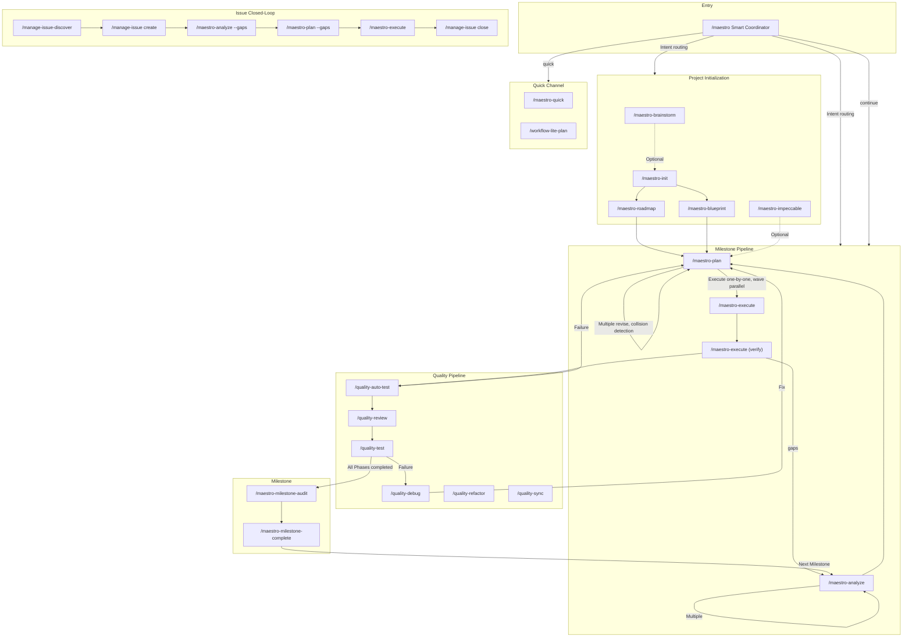
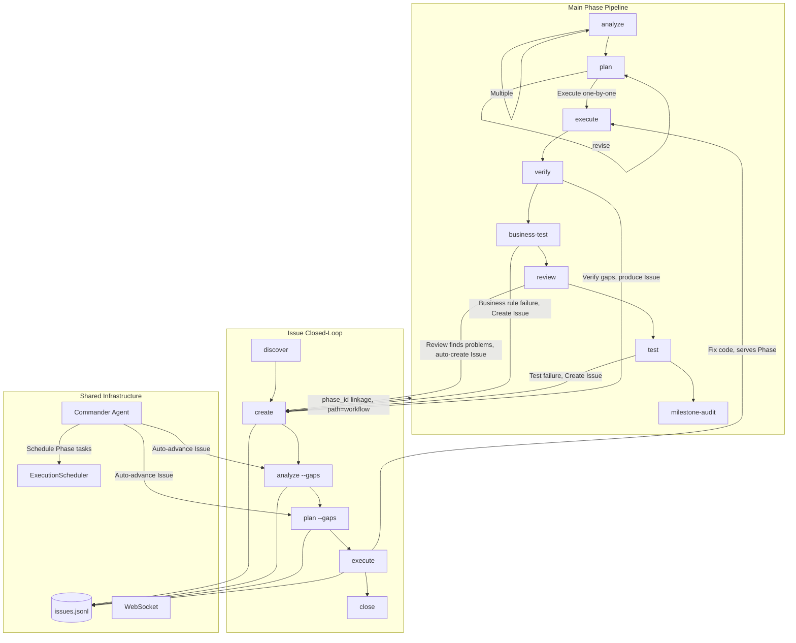

The Maestro command system includes 64 slash commands, organized into 7 major categories. This document provides the command panorama and core workflow navigation.

## Command Overview

| Category | Count | Prefix | Responsibility |
|----------|-------|--------|----------------|
| **Core Workflow** | 32 | `maestro-*` | Lifecycle engine (ralph), initialization, planning, execution, verification, coordination, milestones, overlays, swarm, companion, next, amend, collab, composer, fork, guard, merge, player, tools, ui-codify, universal-workflow, update |
| **Management** | 11 | `manage-*` | Issue lifecycle, codebase documentation, knowledge capture, memory, harvest, status, knowledge-audit, kg-extractors |
| **Quality** | 7 | `quality-*` | Code review, business testing, UAT, debugging, refactoring, retrospective, sync |
| **Specification** | 4 | `spec-*` | Project spec initialization, loading, entry, analytics |
| **Learning** | 4 | `learn-*` | Unified retro (git+decision), follow-along, pattern decompose, investigate |
| **Odyssey** | 5 | `odyssey-*` | Deep debugging, codebase improvement, requirement iterative delivery, deep review+fix, UI optimization |
| **Security** | 1 | `security-*` | Security audit |
| **Scholar Skills** | 10 | `scholar-*` | Research ideation, experiment analysis, paper writing, reviewer response, citation verification, anti-AI polish, LaTeX organization, conference prep, thesis formatting |
| **Other Skills** | 3 | — | Adversarial finding review (insight-challenge), delegation consistency check (delegation-check), prompt file generation (prompt-generator) |

The global entry point `/maestro` is the smart coordinator that automatically selects the optimal command chain based on user intent and project state.

---

## Command Panorama



---

## Interaction Between Main Pipeline and Issues



### Two Issue Processing Paths

| path | Meaning | Source | Lifecycle |
|------|---------|--------|-----------|
| `standalone` | Independent Issue, not bound to a Phase | Manual creation, `/manage-issue-discover`, external import | Independent closed-loop, does not affect Phase progression |
| `workflow` | Phase-linked Issue | `quality-review` auto-create, `quality-auto-test` failure, Phase verification output | May block milestone completion |

---

## 1. Main Workflow

### Project Initialization

```
/maestro-init → /maestro-roadmap or /maestro-blueprint
```

| Step | Command | Purpose | Output |
|------|---------|---------|--------|
| 0 | `/maestro-brainstorm` (optional) | Multi-role brainstorming | guidance-specification.md |
| 1 | `/maestro-init` | Initialize .workflow/ directory | state.json, project.md, specs/ |
| 2a | `/maestro-roadmap` | Lightweight roadmap | roadmap.md |
| 2b | `/maestro-blueprint` | 6-stage specification blueprint | PRD + architecture docs + `.workflow/blueprint/` |

### Milestone Pipeline

```
analyze → plan → execute → verify → review → test → milestone-audit → milestone-complete
```

| Stage | Command | Output | Artifact |
|-------|---------|--------|----------|
| Analyze | `/maestro-analyze` | context.md, analysis.md | ANL-{NNN} |
| Plan | `/maestro-plan` | plan.json + TASK-*.json | PLN-{NNN} |
| Execute | `/maestro-execute` | .summaries/, code changes | EXC-{NNN} |
| Verify | `/maestro-execute` (E2.7) | verification.json | VRF-{NNN} |
| Audit | `/maestro-milestone-audit` | audit-report.md | — |
| Complete | `/maestro-milestone-complete` | archived to milestones/ | — |

**Scope routing**: No args = entire milestone; number = specific milestone (micro mode); text = macro exploration (macro mode). `--dir` specifies upstream output path directly.

### Dual-Layer Analyze

| Layer | Argument | Purpose | Downstream Routing |
|-------|----------|---------|-------------------|
| **Macro** | text, e.g. `"user auth system"` | Requirement impact exploration, produces scope_verdict | large→roadmap, medium/small→plan |
| **Micro** | number, e.g. `1` | Milestone-level 6-dimension deep analysis | Directly to plan |

```bash
# Macro: explore requirement impact before roadmap
/maestro-analyze "Implement multi-tenancy"     # → scope_verdict: large → suggests roadmap

# Micro: Milestone-level deep analysis
/maestro-analyze 1                              # → 6-dimension scoring → directly to plan

# Pass upstream context
/maestro-analyze "Auth module" --from brainstorm:BRN-001
```

### Six Usage Modes

**A. Full milestone**: `analyze → plan → execute → verify` (one shot, all phases)

**B. Per-milestone**: `analyze 1 → plan 1 → execute 1` (each milestone independently, micro layer)

**C. Mixed**: Full analysis + per-phase execution + adhoc mid-stream

**D. Unified planning**: `analyze 1 → analyze 2 → plan → execute` (analyze first, plan once)

**E. Standalone**: `analyze "topic" → plan --dir → execute --dir` (no init/roadmap needed)

**F. Macro exploration**: `analyze "requirement"` → scope_verdict → roadmap or plan (macro layer, use before roadmap)

---

## 2. Quick Channel

```bash
/maestro-quick "Fix login page bug"              # Shortest path
/maestro-quick --full "Refactor API layer"       # With plan validation
/maestro-quick --discuss "Database migration"    # With decision extraction

# Scratch mode (no init required)
/maestro-analyze "Implement JWT auth"            # scope=standalone
/maestro-plan --dir scratch/20260420-analyze-xxx
/maestro-execute --dir scratch/20260420-plan-xxx

# Lite chain
/workflow-lite-plan "Implement Issue system"     # explore→plan→execute→test
```

---

## 3. Issue Closed-Loop

```
Discover → Create → Analyze → Plan → Execute → Close
```

```bash
/manage-issue-discover by-prompt "Check API error handling"
/manage-issue create --title "Memory leak" --severity high
/maestro-analyze --gaps ISS-xxx                  # Root cause analysis
/maestro-plan --gaps                             # Solution planning
/maestro-execute                                 # Execute fix
/manage-issue close ISS-xxx --resolution "Fixed"
```

**Commander Agent** auto-advances unanalyzed Issues with priority `execute > analyze > plan`.

---

## 4. Quality Pipeline

```bash
/maestro-execute → /quality-auto-test → /quality-review → /quality-test → /maestro-milestone-audit
```

| Command | Purpose | Key Parameters |
|---------|---------|----------------|
| `/quality-auto-test {N}` | Smart routing test (spec/gap/code) | `--re-run` `--dry-run` |
| `/quality-review {N}` | Tiered code review | `--level quick\|standard\|deep` |
| `/quality-test {N}` | Session-based UAT | `--auto-fix` |
| `/quality-debug` | Hypothesis-driven debugging | `--from-uat {N}` `--parallel` |
| `/quality-refactor` | Technical debt remediation | `[scope]` |

**Fix loop**: `verify gaps → plan --gaps → execute → verify` or `test failure → debug → plan --gaps → execute`

---

## 5. Coordinator Command Chains

```bash
/maestro "Implement user authentication module"  # Intent recognition → auto-select chain
/maestro -y "Add OAuth support"                  # Fully automatic mode
/maestro continue                                # Auto-execute next step
```

| Chain Name | Command Sequence | Use Case |
|------------|------------------|----------|
| `full-lifecycle` | init→blueprint→...→milestone-audit | Brand new project |
| `roadmap-driven` | init→roadmap→... | Lightweight roadmap |
| `brainstorm-driven` | brainstorm→init→roadmap→... | Start from brainstorming |
| `analyze-plan-execute` | analyze→plan→execute | Quick execution |
| `quality-loop` | review→test→debug | Quality pipeline |
| `milestone-close` | milestone-audit→milestone-complete | Close a milestone |
| `quick` | quick task | Instant small tasks |

---

## 6. Specification and Knowledge

```bash
/spec-setup                                     # Scan project for conventions
/spec-add coding "All APIs use Hono framework"   # Record a spec
/spec-load --role implement                     # Load specs
/manage-codebase-rebuild                        # Rebuild codebase docs
/manage-knowhow search "authentication"         # Search knowhow
/manage-status                                  # Project dashboard
```

---

## 7. Odyssey Series

Academic research and deep improvement workflows — 5 commands covering debugging, improvement, requirement implementation, code review, and UI optimization.

### Command Overview

| Command | Purpose | Core Flow |
|---------|---------|-----------|
| `/odyssey-debug` | Deep debugging closed-loop | Archaeology → Explore → Diagnose → Fix → Confirm → Generalize → Discover → Persist |
| `/odyssey-improve` | Codebase quality improvement | Survey → 6-dimension audit → Diagnose → Fix → Verify → Generalize → Discover → Persist |
| `/odyssey-planex` | Requirement-driven iterative delivery | Parse requirement → Acceptance criteria → Plan → Execute → Verify → Fix loop → Generalize |
| `/odyssey-review-test-fix` | Deep code review + fix | Archaeology → Explore → Multi-dimension review → Exhaustive fix → Confirm → Generalize → Discover → Persist |
| `/odyssey-ui` | UI visual experience optimization | Survey → 6-dimension audit → Divergent exploration → Fix → Verify → Generalize → Discover → Persist |

### Common Traits

- **Zero-residual principle**: Every finding must have a concrete action (fix / create Issue / record decision) — no "report and shelve"
- **Phase auto-commit**: Automatic `git commit` after each phase, no user confirmation needed
- **Multi CLI assist**: Cross-validation via `maestro delegate` with multiple tools
- **Quality gate self-iteration**: Each analytical phase auto-evaluates coverage/depth/actionability, re-enters if insufficient (max 3 rounds)
- **Knowledge persistence**: S_RECORD phase writes reusable knowledge to understanding.md, later persisted via `/spec-add`
- **Session resumable**: `-c` flag resumes last session, `-y` auto-confirms all decision points

### `/odyssey-debug` — Deep Debugging

```bash
/odyssey-debug "Login API returns 500"                # Full debug loop
/odyssey-debug "Memory leak" --template memory-leak   # Predefined strategy
/odyssey-debug "Performance degradation" --skip-fix    # Analysis only
/odyssey-debug "Race condition" -y                     # Full auto mode
/odyssey-debug -c                                      # Resume last session
```

| Parameter | Description |
|-----------|-------------|
| `<issue>` | Issue description |
| `--template <name>` | Predefined strategy: `performance` / `memory-leak` / `race-condition` / `regression` / `crash` |
| `--skip-fix` | Analysis only, no fix execution |
| `--skip-generalize` | Skip generalization scan |
| `--auto` | CLI delegates without confirmation |
| `-y` | Auto-confirm all decisions |
| `-c` | Resume most recent session |

**Output**: `session.json` + `evidence.ndjson` + `explore.json` + `understanding.md` (9 sections)

### `/odyssey-improve` — Codebase Quality Improvement

```bash
/odyssey-improve src/auth/                            # Audit specific module
/odyssey-improve HEAD                                 # Audit recent changes
/odyssey-improve --dimensions performance,security    # Specify dimensions
/odyssey-improve --all --skip-fix                     # Full project scan, review only
```

| Parameter | Description |
|-----------|-------------|
| `<target>` | Module path / `HEAD` / `staged` / keyword / `--all` |
| `--dimensions <list>` | 6-dimension subset: `performance` / `security` / `architecture` / `reliability` / `observability` / `maintainability` |
| `--fix-threshold <severity>` | Fix threshold: `all` / `critical` / `high` / `medium` / `low` |
| `--skip-fix` | Audit + diagnose only |
| `--skip-generalize` | Skip generalization |

**6 dimensions**: Performance (hot paths, N+1 queries), Security (OWASP Top 10), Architecture (layer violations, circular deps), Reliability (error handling), Observability (logging coverage), Maintainability (complexity, dead code)

### `/odyssey-planex` — Requirement-Driven Iterative Delivery

```bash
/odyssey-planex "Implement JWT authentication"         # Full requirement loop
/odyssey-planex "Fix login bug" --template bugfix      # Bug fix template
/odyssey-planex "Refactor API layer" --template refactor  # Refactor template
/odyssey-planex "Implement payments" --max-iterations 5   # Max 5 verify cycles
/odyssey-planex "Migrate DB" --method cli --executor codex  # CLI execution
```

| Parameter | Description |
|-----------|-------------|
| `<requirement>` | Requirement description |
| `--template <name>` | Template: `feature` / `bugfix` / `refactor` / `migration` / `api-endpoint` |
| `--max-iterations N` | Max verify→fix cycles (default 3) |
| `--method agent\|cli\|auto` | Execution method |
| `--executor <tool>` | Explicit CLI executor tool |
| `--skip-verify` | Skip post-execution validation gate |

**Core loop**: Define acceptance criteria → Plan → Execute → Verify each criterion → Fix failures → Re-verify until all pass

### `/odyssey-review-test-fix` — Deep Code Review

```bash
/odyssey-review-test-fix src/api/                     # Review specific directory
/odyssey-review-test-fix HEAD                         # Review recent changes
/odyssey-review-test-fix --dimensions correctness,security  # Specify dimensions
/odyssey-review-test-fix --fix-threshold high         # Only fix critical + high
```

| Parameter | Description |
|-----------|-------------|
| `<target>` | File/dir path / `HEAD` / `staged` / Phase number / PR number |
| `--dimensions <list>` | Dimension subset: `correctness` / `security` / `performance` / `architecture` |
| `--fix-threshold <severity>` | Fix threshold (default `all` = exhaustive) |
| `--skip-fix` | Review only |
| `--skip-generalize` | Skip generalization |

**Exhaustive fix**: Per severity tier (critical → high → medium → low), re-review modified area after each tier

### `/odyssey-ui` — UI Visual Experience Optimization

```bash
/odyssey-ui src/components/Header/                    # Audit specific component
/odyssey-ui --dimensions visual_hierarchy,accessibility  # Specify dimensions
/odyssey-ui --skip-fix                                # Review + divergent exploration only
```

| Parameter | Description |
|-----------|-------------|
| `<target>` | Component/page path / `staged` / `HEAD` / feature area name |
| `--dimensions <list>` | 6-dimension subset: `visual_hierarchy` / `interaction_states` / `accessibility` / `responsiveness` / `micro_interactions` / `edge_cases` |
| `--skip-fix` | Review only |
| `--skip-generalize` | Skip generalization |

**Unique phase**: S_DIVERGE (Divergent exploration) — Goes beyond defect fixing to ask "what would make this delightful?"

---

## 8. Ralph Lifecycle Engine

Ralph is the adaptive lifecycle engine that reads project state → infers position → builds adaptive step chains → delegates execution.

### `/maestro-ralph` — Adaptive Decision Engine

```bash
/maestro-ralph "Implement user authentication"        # Auto-infer position and build chain
/maestro-ralph "phase 2"                              # Specify phase
/maestro-ralph status                                 # View current session status
/maestro-ralph continue                               # Resume execution
/maestro-ralph -y "Refactor API layer"                # Full auto mode
```

**Core invariants**:
- Ralph only builds and evaluates, never executes steps
- `status.json` is the single source of truth
- Hands off execution via `Skill("maestro-ralph-execute")`
- Every step must have `completion_confirmed: true`

**Decision gates**: post-execute / post-business-test / post-review / post-test / post-goal-audit / post-analyze-scope / post-milestone — auto-evaluates quality gate results, decides proceed / fix / escalate

### `/maestro-ralph-execute` — Single-Step Executor

```bash
/maestro-ralph-execute                                # Execute next pending step
/maestro-ralph-execute -y                             # Auto mode
```

Ralph's executor: Locate session → Find next step → Load via `maestro ralph next` CLI → Inline execute → `maestro ralph complete` → Self-invoke next. Mutual invocation with `/maestro-ralph` forms a self-perpetuating work loop.

---

## 9. Additional maestro-* Commands

### `/maestro-amend` — Workflow Deficiency Fix

```bash
/maestro-amend --scan                                 # Auto-scan .workflow/ for signals
/maestro-amend --from-verify .workflow/scratch/xxx    # Collect from verification results
/maestro-amend --from-review .workflow/scratch/xxx    # Collect from code review
/maestro-amend --from-issues ISS-001,ISS-002          # Collect from Issues
/maestro-amend "Missing verification after execute"   # Direct description
```

Signal-driven overlay generator — collects workflow deficiency signals from multiple sources, diagnoses which commands need amendment, batch-generates targeted overlays. Unlike `/maestro-overlay` (single explicit intent), this command **discovers** what needs amending.

### `/maestro-collab` — Multi-Tool Cross-Verification

```bash
/maestro-collab "Evaluate microservice decomposition"  # Multi-tool parallel analysis
/maestro-collab "Review security architecture" --tools gemini,claude  # Specify tools
/maestro-collab "API design review" --mode analysis    # Read-only analysis mode
```

Fans out requirement to multiple CLI tools in parallel → cross-verifies for consensus/conflicts → synthesizes unified report (collab-report.md + context.md + conclusions.json).

### `/maestro-composer` — Workflow Template Composer

```bash
/maestro-composer "Analyze → Plan → Execute → Test"   # Create template from natural language
/maestro-composer --resume                             # Resume incomplete design
/maestro-composer --edit ~/.maestro/templates/workflows/xxx.json  # Edit existing template
```

Interactive workflow template composer: natural language → DAG template. Three-phase confirmation (intent → node mapping → pipeline visualization), auto-injects checkpoints, produces templates executable by `/maestro-player`.

### `/maestro-fork` — Milestone Worktree Parallel Dev

```bash
/maestro-fork -m 2                                    # Create worktree for Milestone 2
/maestro-fork -m 2 --base develop                     # Specify base branch
/maestro-fork -m 2 --sync                             # Sync latest main changes
```

Creates or syncs a milestone-level git worktree for parallel development. Auto-copies shared `.workflow/` files, writes scope marker and scoped state.json.

### `/maestro-merge` — Milestone Worktree Merge

```bash
/maestro-merge -m 2                                   # Merge Milestone 2 worktree
/maestro-merge -m 2 --dry-run                         # Preview merge
/maestro-merge -m 2 --no-cleanup                      # Merge but keep worktree
/maestro-merge -m 2 --continue                        # Continue after conflict resolution
```

Merges a milestone worktree branch back into main, syncs scratch artifacts, reconciles artifact registry. Two-phase: git merge first, artifact sync second.

### `/maestro-guard` — Editing Boundary Management

```bash
/maestro-guard on                                     # Enable boundary protection
/maestro-guard off                                    # Disable
/maestro-guard status                                 # View status
/maestro-guard allow src/                             # Allow editing src/ directory
/maestro-guard deny node_modules/                     # Deny editing node_modules/
```

Configures directory-level write boundaries enforced by the `workflow-guard` PreToolUse hook.

### `/maestro-milestone-release` — Version Release

```bash
/maestro-milestone-release                            # Auto-bump minor version
/maestro-milestone-release 2.0.0                      # Specify version
/maestro-milestone-release --bump patch               # Patch bump
/maestro-milestone-release --dry-run                  # Preview changes
/maestro-milestone-release --no-tag --no-push         # Version + changelog only
```

Packages a completed milestone into a releasable version: version bump → changelog generation → git tag → push. Downstream of `/maestro-milestone-complete`.

### `/maestro-overlay` — Command Overlay Creation

```bash
/maestro-overlay "Always run review after execute"     # Create overlay from natural language
/maestro-overlay "Load domain knowledge before analyze"  # Inject required_reading
```

Turns natural-language instructions into command overlays — JSON patch files that augment `.claude/commands/*.md` non-invasively. Supports injection point preview, skill chain configuration, idempotent installation. Management via `maestro overlay list` (ink TUI).

### `/maestro-player` — Workflow Template Execution

```bash
/maestro-player wft-auth-flow-20260601                # Execute specified template
/maestro-player --list                                # List available templates
/maestro-player -c                                    # Resume paused session
/maestro-player wft-xxx --context goal="Implement auth"  # Bind context variables
/maestro-player wft-xxx --dry-run                     # Preview execution plan
```

Loads workflow templates (from `/maestro-composer`) → binds context variables → executes DAG nodes in topological order → persists state at checkpoints → supports resume. Four node types: skill / cli / agent / checkpoint.

### `/maestro-tools-execute` — Tool Spec Execution

```bash
/maestro-tools-execute integration-test               # Execute by name
/maestro-tools-execute --category coding              # Select by category
/maestro-tools-execute --category review --keyword api  # Keyword filter
/maestro-tools-execute                                # Interactive selection
```

Loads registered tool specs (knowhow documents with `tool: true`) and executes them step-by-step. Supports direct invocation by name or category-based listing.

### `/maestro-tools-register` — Tool Spec Registration

```bash
/maestro-tools-register extract OAuth PKCE flow from src/auth/   # Extract from code
/maestro-tools-register generate Stripe webhook verification      # Generate new tool
/maestro-tools-register optimize e2e-checkout                     # Optimize existing tool
/maestro-tools-register promote RCP-db-migration as test tool     # Promote knowhow to tool
```

Codifies reusable business processes as knowhow documents (`tool: true`). Four modes: Extract (from code), Generate (new tool), Optimize (existing), Promote (elevate existing knowhow).

### `/maestro-ui-codify` — Design System Extraction

```bash
/maestro-ui-codify src/components/                    # Extract design system from source
/maestro-ui-codify src/ --package-name my-design      # Specify package name
/maestro-ui-codify src/ --output-dir .workflow/ref    # Specify output directory
```

4-phase pipeline: Validate → Extract (3 parallel Agents) → Package (preview.html) → Knowhow persistence. Outputs design-tokens.json + layout-templates.json + preview + knowhow manifest.

### `/maestro-universal-workflow` — Dynamic Adversarial Workflow Generation

```bash
/maestro-universal-workflow "Evaluate 3 caching strategies"  # Auto-match or generate
/maestro-universal-workflow "Review security" --depth deep   # Deep adversarial mode
/maestro-universal-workflow "Compare options" --dry-run      # Generate only
/maestro-universal-workflow --from wf-analyze "Extend analysis"  # Modify existing script
```

Dynamic workflow generator: scan library for matches → generate task-specific Workflow scripts (with adversarial patterns) → execute → persist. Scripts saved to `~/.maestro/workflows/dynamic/uwf-*.js` for reuse. Three depths: shallow (1 skeptic) → standard (3-way advocacy + referee) → deep (cross-verify + meta-skeptic).

### `/maestro-update` — Version Upgrade

```bash
/maestro-update                                       # Detect and upgrade
/maestro-update --dry-run                             # Preview upgrade plan
/maestro-update --force                               # Skip confirmation
/maestro-update --setup-only                          # Run only current version setup
```

Detects current version → runs schema migration → executes version-specific upgrade workflow. Auto-backs up state.json, supports incremental migration.

---

## 10. CLI Subsystems

### `maestro install toggle` — Command Enable/Disable

```bash
maestro install toggle                                # Interactive TUI
maestro install toggle --type command                  # Manage commands only
maestro install toggle --list                         # List all installed items
maestro install toggle --enable "maestro-ralph,maestro-search"   # Enable specified
maestro install toggle --disable "team-swarm,team-review"        # Disable specified
```

Provides both interactive TUI and non-interactive CLI to manage enabled state of installed commands, skills, and agents.

### `maestro workspace` — Workspace Management

```bash
maestro workspace link <path>                         # Link external workspace
maestro workspace unlink <path>                       # Unlink
maestro workspace list                                # List all linked workspaces
maestro workspace status                              # View workspace status
```

Manages multi-project workspace links, supporting cross-project knowledge sharing and artifact references.

### `maestro domain` — Domain Knowledge Management

```bash
maestro domain                                        # View current domain config
```

Manages project domain knowledge configuration, affecting spec injection and knowledge search scope.

### `/manage-kg-extractors` — Knowledge Graph Extractor Config

```bash
/manage-kg-extractors                                 # Scan and generate extraction rules
/manage-kg-extractors --scan-only                     # Scan only, no write
/manage-kg-extractors --append                        # Append to existing config
/manage-kg-extractors --language typescript            # Limit to specific language
```

Analyzes codebase patterns to auto-generate `.workflow/kg/extractors.yaml` — teaches MaestroGraph's codegraph extractor to recognize project-specific symbols (builder/factory APIs, domain constants, custom decorators, etc.). 3 parallel agents scan builder/factory calls, constants/annotations, and framework-specific patterns.

### `store_knowhow` MCP Tool

`store_knowhow` is a built-in MCP tool for knowledge entry storage and search:

| Operation | Description |
|-----------|-------------|
| `add` | Create new knowhow entry (type: session/tip/template/recipe/reference/decision/asset/blueprint/document) |
| `search` | Full-text search knowhow entries |

Entries are auto-indexed by WikiIndexer (type=knowhow, category={type}). Supports tags, categorization, and spec category bridging (`specCategory` parameter allows knowhow entries to be injected alongside spec entries).

---

## 11. Scholar Skills

10 academic research skills covering the full pipeline from ideation to publication.

| Skill | Purpose | Trigger Words |
|-------|---------|---------------|
| `scholar-ideation` | Research ideation & literature review | brainstorm research ideas, identify research gaps |
| `scholar-experiment` | Experimental results analysis | analyze experimental results, statistical analysis |
| `scholar-writing` | End-to-end paper writing | write paper, draft paper |
| `scholar-review` | Paper self-review & reviewer response | review paper, write rebuttal |
| `scholar-rebuttal-pro` | Enhanced reviewer response (multi-perspective) | rebuttal, respond to reviewers |
| `scholar-citation-verify` | Citation verification (4-layer) | verify citations, check references |
| `scholar-anti-ai-writing` | Remove AI writing patterns | remove AI patterns, humanize text |
| `scholar-latex-organizer` | LaTeX template organization | organize LaTeX template, prepare Overleaf |
| `scholar-publish` | Post-acceptance conference preparation | conference preparation, prepare presentation |
| `scholar-thesis-docx` | Thesis/dissertation Word formatting | thesis formatting, dissertation Word |

---

## 12. Other Skills

| Skill | Purpose | Trigger Words |
|-------|---------|---------------|
| `insight-challenge` | Adversarial review of code quality findings | insight-challenge, challenge finding |
| `delegation-check` | Delegation prompt vs role definition consistency check | check delegation, delegation conflict |
| `prompt-generator` | Claude Code prompt file generation/conversion | create command, create skill, create agent |

### `insight-challenge` — Finding Adversarial Review

Adversarial review of code quality findings. Challenges insights with counter-evidence, verifies claims against source code, and produces structured verdicts (confirmed / weakened / overturned).

### `delegation-check` — Delegation Consistency Check

Validates that command delegation prompts (Agent() calls) and agent role definitions respect content separation boundaries. Detects 7 conflict dimensions: role re-definition, domain expertise leaking, quality gate duplication, output format conflicts, process override, scope authority conflicts, and missing contracts.

### `prompt-generator` — Prompt File Generation

Generates or converts Claude Code prompt files — command orchestrators, skill files, agent role definitions, or style conversion of existing files. Follows GSD-style content separation with built-in quality gates.

---

## Specialized Guides

| Topic | Guide |
|-------|-------|
| Quality pipeline details | [Quality Pipeline Guide](./quality-pipeline-guide.md) |
| Issue discovery & closed-loop | [Issue Discover Guide](./issue-discover-guide.md) |
| Learning toolkit | [Learn Tools Guide](./learn-tools-guide.md) |
| Knowledge graph management | [Knowledge Management Guide](./knowledge-management-guide.md) |
| Search system | [Search System Guide](./search-system-guide.md) |
| Installation guide | [Install Guide](./install-guide.md) |
| CLI command reference | [CLI Commands Guide](./cli-commands-guide.md) |
| Spec system | [Spec System Guide](./spec-system-guide.md) |
| Spec injection mechanism | [Spec Injection Guide](./spec-injection-guide.md) |
| MCP tools reference | [MCP Tools Guide](./mcp-tools-guide.md) |
| Delegate async tasks | [Delegate Async Guide](./delegate-async-guide.md) |
| Overlay command extension | [Overlay Guide](./overlay-guide.md) |
| Hooks automation | [Hooks Guide](./hooks-guide.md) |
