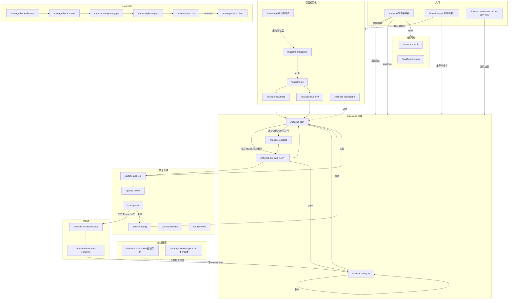
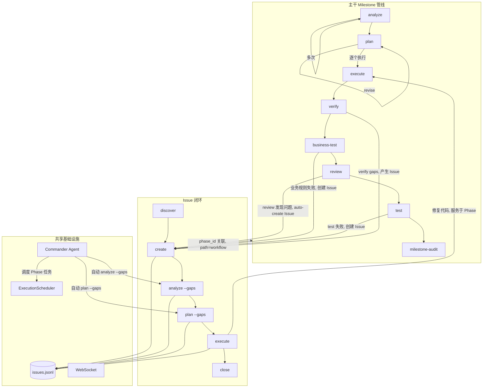

Maestro 命令系统包含 64 个 slash 命令，分为 7 大类。本文档提供命令全景图和核心工作流导航。

## 命令总览

| 类别 | 命令数 | 前缀 | 职责 |
|------|--------|------|------|
| **核心工作流** | 32 | `maestro-*` | 生命周期引擎（ralph）、初始化、规划、执行、验证、协调、milestone、overlay、swarm、companion、next、amend、collab、composer、fork、guard、merge、player、tools、ui-codify、universal-workflow、update |
| **管理** | 11 | `manage-*` | Issue 生命周期、代码库文档、知识捕获、记忆管理、harvest、status、knowledge-audit、kg-extractors |
| **质量** | 7 | `quality-*` | 代码审查、业务测试、UAT、调试、重构、复盘、同步 |
| **规范** | 4 | `spec-*` | 项目规范初始化、加载、录入、分析 |
| **学习** | 4 | `learn-*` | 统一复盘（git+决策）、跟读学习、模式拆解、系统探究 |
| **奥德赛** | 5 | `odyssey-*` | 深度调试、代码库改进、需求迭代实现、深度审查+修复、UI 优化 |
| **安全** | 1 | `security-*` | 安全审计 |
| **学术技能** | 10 | `scholar-*` | 研究构思、实验分析、论文写作、审稿回复、引用验证、AI 去痕、LaTeX 整理、会议准备、学位论文 |
| **其他技能** | 3 | — | 发现对抗审查（insight-challenge）、委托一致性检查（delegation-check）、提示文件生成（prompt-generator） |

全局入口 `/maestro` 是智能协调器，根据用户意图和项目状态自动选择最优命令链。

---

## 命令全景图



---

## 主干与 Issue 的交互关系



### Issue 两种处理路径

| path | 含义 | 来源 | 生命周期 |
|------|------|------|----------|
| `standalone` | 独立 Issue，不绑定 Phase | 手动创建、`/manage-issue-discover`、外部导入 | 独立闭环，不影响 Phase 推进 |
| `workflow` | Phase 关联 Issue | `quality-review` auto-create、`quality-auto-test` 失败产生、Phase 验证产生 | 可能阻塞 milestone 完成 |

---

## 一、主干工作流

### 项目初始化

```
/maestro-init → /maestro-roadmap 或 /maestro-blueprint
```

| 步骤 | 命令 | 作用 | 产出 |
|------|------|------|------|
| 0 | `/maestro-brainstorm` (可选) | 多角色头脑风暴 | guidance-specification.md |
| 1 | `/maestro-init` | 初始化 .workflow/ 目录 | state.json, project.md, specs/ |
| 2a | `/maestro-roadmap` | 轻量路线图 | roadmap.md |
| 2b | `/maestro-blueprint` | 6 阶段规范蓝图 | PRD + 架构文档 + `.workflow/blueprint/` |

### Milestone 管线

```
analyze → plan → execute → verify → review → test → milestone-audit → milestone-complete
```

| 阶段 | 命令 | 产出 | Artifact |
|------|------|------|----------|
| 分析 | `/maestro-analyze` | context.md, analysis.md | ANL-{NNN} |
| 规划 | `/maestro-plan` | plan.json + TASK-*.json | PLN-{NNN} |
| 执行 | `/maestro-execute` | .summaries/, 代码变更 | EXC-{NNN} |
| 验证 | `/maestro-execute` (E2.7) | verification.json | VRF-{NNN} |
| 审计 | `/maestro-milestone-audit` | audit-report.md | — |
| 完成 | `/maestro-milestone-complete` | 归档到 milestones/ | — |

**Scope 路由**：无参数 = milestone 全量；数字 = 指定 milestone（micro 模式）；文本 = 宏观探索（macro 模式）。`--dir` 直接指定上游产物路径。

### 双层 Analyze

| 层级 | 参数 | 作用 | 下游路由 |
|------|------|------|----------|
| **Macro（宏观）** | 文本，如 `"用户认证系统"` | 需求影响面探索，产出 scope_verdict | large→roadmap, medium/small→plan |
| **Micro（微观）** | 数字，如 `1` | Milestone 级 6 维度深度分析 | 直接进入 plan |

```bash
# Macro：在 roadmap 之前探索需求影响面
/maestro-analyze "实现多租户架构"           # → scope_verdict: large → 建议 roadmap

# Micro：Milestone 级深度分析
/maestro-analyze 1                          # → 6 维度评分 → 直接进入 plan

# 传递上游上下文
/maestro-analyze "认证模块" --from brainstorm:BRN-001
```

### 六种使用模式

**A. 全量模式**：`analyze → plan → execute → verify`（一步覆盖所有 phase）

**B. 逐 Milestone**：`analyze 1 → plan 1 → execute 1`（每个 milestone 独立，micro 层）

**C. 混合模式**：全量分析 + 逐 phase 执行 + 中途 adhoc

**D. 统一规划**：`analyze 1 → analyze 2 → plan → execute`（分析后统一规划）

**E. 独立模式**：`analyze "topic" → plan --dir → execute --dir`（无需 init/roadmap）

**F. 宏观探索**：`analyze "需求描述"` → scope_verdict → roadmap 或 plan（macro 层，roadmap 之前使用）

---

## 二、快速渠道

```bash
/maestro-quick "修复登录页面 bug"              # 最短路径
/maestro-quick --full "重构 API 层"            # 带规划验证
/maestro-quick --discuss "数据库迁移方案"       # 带决策提取

# Scratch 模式（无需 init）
/maestro-analyze "实现 JWT 认证"               # scope=standalone
/maestro-plan --dir scratch/20260420-analyze-xxx
/maestro-execute --dir scratch/20260420-plan-xxx

# Lite 链
/workflow-lite-plan "实现 Issue 闭环系统"      # 探索→规划→执行→测试
```

---

## 三、Issue 闭环

```
发现 → 创建 → 分析 → 规划 → 执行 → 关闭
```

```bash
/manage-issue-discover by-prompt "检查 API 的错误处理"
/manage-issue create --title "内存泄漏" --severity high
/maestro-analyze --gaps ISS-xxx                 # 根因分析
/maestro-plan --gaps                            # 方案规划
/maestro-execute                                # 执行修复
/manage-issue close ISS-xxx --resolution "Fixed"
```

**Commander Agent** 可自动推进未分析的 Issue，按 `execute > analyze > plan` 优先级调度。

---

## 四、质量管线

```bash
/maestro-execute → /quality-auto-test → /quality-review → /quality-test → /maestro-milestone-audit
```

| 命令 | 用途 | 关键参数 |
|------|------|----------|
| `/quality-auto-test {N}` | 智能路由测试（spec/gap/code） | `--re-run` `--dry-run` |
| `/quality-review {N}` | 分层代码审查 | `--level quick\|standard\|deep` |
| `/quality-test {N}` | 会话式 UAT | `--auto-fix` |
| `/quality-debug` | 假设驱动调试 | `--from-uat {N}` `--parallel` |
| `/quality-refactor` | 技术债务治理 | `[scope]` |

**修复循环**：`verify gaps → plan --gaps → execute → verify` 或 `test 失败 → debug → plan --gaps → execute`

---

## 五、协调器命令链

```bash
/maestro "实现用户认证模块"          # 意图识别 → 自动选择命令链
/maestro -y "添加 OAuth 支持"        # 全自动模式
/maestro continue                    # 自动执行下一步
```

| 链名 | 命令序列 | 适用场景 |
|------|----------|----------|
| `full-lifecycle` | init→blueprint→...→milestone-audit | 全新项目 |
| `roadmap-driven` | init→roadmap→... | 轻量路线图 |
| `brainstorm-driven` | brainstorm→init→roadmap→... | 从头脑风暴开始 |
| `analyze-plan-execute` | analyze→plan→execute | 快速执行 |
| `quality-loop` | review→test→debug | 质量流水线 |
| `milestone-close` | milestone-audit→milestone-complete | 关闭里程碑 |
| `quick` | quick task | 即时小任务 |

---

## 六、规范与知识

```bash
/spec-setup                                     # 扫描项目生成规范
/spec-add coding "所有 API 使用 Hono 框架"       # 录入规范
/spec-load --role implement                     # 加载规范
/manage-codebase-rebuild                        # 重建代码库文档
/manage-knowhow search "认证"                   # 搜索知识复用
/manage-knowledge-audit --scope all             # 审计三存储，清理过期/矛盾条目
/manage-status                                  # 项目仪表板
/maestro-companion before --task "实现认证"      # 任务前加载知识上下文
```

### 新增命令速查

| 命令 | 定位 | 使用场景 |
|------|------|----------|
| `/maestro-swarm-workflow` | 并行加速层 | 8 个 Workflow 脚本覆盖 analyze/brainstorm/review/verify/grill/plan/execute/milestone-audit |
| `/maestro-companion` | 知识伴侣 | before（加载上下文）→ note（记录洞察）→ after（沉淀知识）→ route（推荐下一步） |
| `/maestro-next` | 单命令推荐 | 轻量路由，不创建 session，推荐 1 个原子命令 + 2-3 备选 |
| `/maestro-grill` | 压力测试 | 对抗式苏格拉底访谈，验证方案假设，产出 context-package |
| `/maestro-blueprint` | 正式规格 | 6 阶段文档链（Brief → PRD → Architecture → Epics），与 brainstorm 互补 |
| `/manage-knowledge-audit` | 知识审计 | spec/knowhow/artifact 三存储审计淘汰（keep/deprecate/delete） |
| `/team-swarm` | 蚁群智能 | ACO 驱动群体优化，信息素收敛，4 角色 + Python 控制器 |

---

## 七、奥德赛系列（Odyssey）

学术研究与深度改进工作流，5 个命令覆盖调试、改进、需求实现、代码审查、UI 优化。

### 命令总览

| 命令 | 定位 | 核心流程 |
|------|------|----------|
| `/odyssey-debug` | 深度调试闭环 | 考古 → 探索 → 诊断 → 修复 → 确认 → 泛化 → 发现 → 沉淀 |
| `/odyssey-improve` | 代码库质量提升 | 调查 → 6 维审查 → 诊断 → 修复 → 验证 → 泛化 → 发现 → 沉淀 |
| `/odyssey-planex` | 需求驱动迭代实现 | 解析需求 → 验收标准 → 规划 → 执行 → 验证 → 修复循环 → 泛化 |
| `/odyssey-review-test-fix` | 深度代码审查 + 修复 | 考古 → 探索 → 多维审查 → 穷尽修复 → 确认 → 泛化 → 发现 → 沉淀 |
| `/odyssey-ui` | UI 视觉体验优化 | 调查 → 6 维审查 → 发散探索 → 修复 → 验证 → 泛化 → 发现 → 沉淀 |

### 共同特征

- **Zero-residual 原则**：每个发现必须有具体动作（修复/创建 Issue/记录决策），不允许"只报告不处理"
- **阶段自动提交**：每个阶段完成后自动 `git commit`，无需用户确认
- **多 CLI 辅助**：通过 `maestro delegate` 调用多个工具交叉验证
- **质量门自迭代**：每个分析阶段自动评估覆盖度/深度/可操作性，不足时重新进入（最多 3 轮）
- **知识沉淀**：S_RECORD 阶段将可复用知识写入 understanding.md，后续通过 `/spec-add` 永久化
- **会话可恢复**：`-c` 标志恢复最近会话，`-y` 自动确认所有决策点

### `/odyssey-debug` — 深度调试

```bash
/odyssey-debug "登录接口返回 500"                     # 完整调试闭环
/odyssey-debug "内存泄漏" --template memory-leak       # 预定义策略模板
/odyssey-debug "性能劣化" --skip-fix                   # 仅分析不修复
/odyssey-debug "竞态条件" -y                           # 全自动模式
/odyssey-debug -c                                      # 恢复上次会话
```

| 参数 | 说明 |
|------|------|
| `<issue>` | 问题描述 |
| `--template <name>` | 预定义策略：`performance` / `memory-leak` / `race-condition` / `regression` / `crash` |
| `--skip-fix` | 仅分析，不执行修复 |
| `--skip-generalize` | 跳过泛化扫描 |
| `--auto` | CLI delegate 不需确认 |
| `-y` | 自动确认所有决策 |
| `-c` | 恢复最近会话 |

**输出**：`session.json` + `evidence.ndjson` + `explore.json` + `understanding.md`（9 节）

### `/odyssey-improve` — 代码库质量提升

```bash
/odyssey-improve src/auth/                            # 审查指定模块
/odyssey-improve HEAD                                 # 审查最近变更
/odyssey-improve --dimensions performance,security    # 指定审查维度
/odyssey-improve --all --skip-fix                     # 全项目扫描，仅审查
```

| 参数 | 说明 |
|------|------|
| `<target>` | 模块路径 / `HEAD` / `staged` / 关键词 / `--all` |
| `--dimensions <list>` | 6 维子集：`performance` / `security` / `architecture` / `reliability` / `observability` / `maintainability` |
| `--fix-threshold <severity>` | 修复阈值：`all` / `critical` / `high` / `medium` / `low` |
| `--skip-fix` | 仅审查诊断 |
| `--skip-generalize` | 跳过泛化 |

**6 维审查**：性能（热点路径、N+1 查询）、安全（OWASP Top 10）、架构（层违规、循环依赖）、可靠性（错误处理）、可观测性（日志覆盖）、可维护性（复杂度、死代码）

### `/odyssey-planex` — 需求驱动迭代实现

```bash
/odyssey-planex "实现 JWT 认证"                        # 完整需求闭环
/odyssey-planex "修复登录 bug" --template bugfix       # Bug 修复模板
/odyssey-planex "重构 API 层" --template refactor      # 重构模板
/odyssey-planex "实现支付" --max-iterations 5          # 最多 5 轮验证
/odyssey-planex "迁移数据库" --method cli --executor codex  # CLI 执行
```

| 参数 | 说明 |
|------|------|
| `<requirement>` | 需求描述 |
| `--template <name>` | 模板：`feature` / `bugfix` / `refactor` / `migration` / `api-endpoint` |
| `--max-iterations N` | 验证→修复循环最大次数（默认 3） |
| `--method agent\|cli\|auto` | 执行方式 |
| `--executor <tool>` | 指定 CLI 执行工具 |
| `--skip-verify` | 跳过执行后验证门控 |

**核心循环**：定义验收标准 → 规划 → 执行 → 逐条验证 → 修复失败项 → 重新验证，直到所有标准通过

### `/odyssey-review-test-fix` — 深度代码审查

```bash
/odyssey-review-test-fix src/api/                     # 审查指定目录
/odyssey-review-test-fix HEAD                         # 审查最近变更
/odyssey-review-test-fix --dimensions correctness,security  # 指定维度
/odyssey-review-test-fix --fix-threshold high         # 仅修复 critical + high
```

| 参数 | 说明 |
|------|------|
| `<target>` | 文件/目录路径 / `HEAD` / `staged` / Phase 编号 / PR 编号 |
| `--dimensions <list>` | 维度子集：`correctness` / `security` / `performance` / `architecture` |
| `--fix-threshold <severity>` | 修复阈值（默认 `all` = 穷尽所有 severity） |
| `--skip-fix` | 仅审查 |
| `--skip-generalize` | 跳过泛化 |

**穷尽修复**：按 severity 逐轮（critical → high → medium → low），每轮修复后 re-review 修改区域

### `/odyssey-ui` — UI 视觉体验优化

```bash
/odyssey-ui src/components/Header/                    # 审查指定组件
/odyssey-ui --dimensions visual_hierarchy,accessibility  # 指定维度
/odyssey-ui --skip-fix                                # 仅审查 + 发散探索
```

| 参数 | 说明 |
|------|------|
| `<target>` | 组件/页面路径 / `staged` / `HEAD` / 功能区域名 |
| `--dimensions <list>` | 6 维子集：`visual_hierarchy` / `interaction_states` / `accessibility` / `responsiveness` / `micro_interactions` / `edge_cases` |
| `--skip-fix` | 仅审查 |
| `--skip-generalize` | 跳过泛化 |

**独特阶段**：S_DIVERGE（发散探索）— 超越缺陷修复，探索"什么会让这个界面令人愉悦？"

---

## 八、Ralph 生命周期引擎

Ralph 是自适应生命周期引擎，读取项目状态 → 推断位置 → 构建自适应步骤链 → 委托执行。

### `/maestro-ralph` — 自适应决策引擎

```bash
/maestro-ralph "实现用户认证"                          # 自动推断位置并构建链
/maestro-ralph "phase 2"                              # 指定 phase
/maestro-ralph status                                 # 查看当前会话状态
/maestro-ralph continue                               # 恢复执行
/maestro-ralph -y "重构 API 层"                       # 全自动模式
```

**核心不变量**：
- Ralph 只构建和评估，不执行步骤
- `status.json` 是唯一真源
- 通过 `Skill("maestro-ralph-execute")` 移交执行
- 每个步骤必须 `completion_confirmed: true`

**决策门控**：post-execute / post-business-test / post-review / post-test / post-goal-audit / post-analyze-scope / post-milestone — 自动评估质量门结果，决定 proceed / fix / escalate

### `/maestro-ralph-execute` — 单步执行器

```bash
/maestro-ralph-execute                                # 执行下一个 pending step
/maestro-ralph-execute -y                             # 自动模式
```

Ralph 的执行器：定位会话 → 找下一步 → 通过 `maestro ralph next` CLI 加载 → 内联执行 → `maestro ralph complete` → 自调用下一步。与 `/maestro-ralph` 互调形成自延续工作循环。

---

## 九、缺失 maestro-* 命令补充

### `/maestro-amend` — 工作流缺陷修复

```bash
/maestro-amend --scan                                 # 自动扫描 .workflow/ 发现信号
/maestro-amend --from-verify .workflow/scratch/xxx    # 从验证结果收集信号
/maestro-amend --from-review .workflow/scratch/xxx    # 从代码审查收集信号
/maestro-amend --from-issues ISS-001,ISS-002          # 从 Issue 收集信号
/maestro-amend "execute 后缺少验证步骤"                # 直接描述缺陷
```

信号驱动的 overlay 生成器 — 从多个来源收集工作流缺陷信号，诊断哪些命令需要修补，批量生成定向 overlay。与 `/maestro-overlay`（单个显式意图）不同，此命令**发现**需要修补的内容。

### `/maestro-collab` — 多工具交叉验证

```bash
/maestro-collab "评估微服务拆分方案"                    # 多工具并行分析
/maestro-collab "审查安全架构" --tools gemini,claude   # 指定工具
/maestro-collab "API 设计评审" --mode analysis         # 只读分析模式
```

将需求扇出到多个 CLI 工具并行执行 → 交叉验证共识/冲突 → 合成统一报告（collab-report.md + context.md + conclusions.json）。

### `/maestro-composer` — 工作流模板编排

```bash
/maestro-composer "分析→规划→执行→测试"                # 从自然语言创建模板
/maestro-composer --resume                            # 恢复未完成设计
/maestro-composer --edit ~/.maestro/templates/workflows/xxx.json  # 编辑现有模板
```

交互式工作流模板编排器：自然语言 → DAG 模板。三阶段确认（意图 → 节点映射 → Pipeline 可视化），自动注入 checkpoint，输出可由 `/maestro-player` 执行的模板。

### `/maestro-fork` — Milestone Worktree 并行开发

```bash
/maestro-fork -m 2                                    # 为 Milestone 2 创建 worktree
/maestro-fork -m 2 --base develop                     # 指定基础分支
/maestro-fork -m 2 --sync                             # 同步主分支最新变更
```

创建或同步 milestone 级 git worktree 用于并行开发。自动复制共享 `.workflow/` 文件，写入 scope marker 和 scoped state.json。

### `/maestro-merge` — Milestone Worktree 合并

```bash
/maestro-merge -m 2                                   # 合并 Milestone 2 worktree
/maestro-merge -m 2 --dry-run                         # 预览合并
/maestro-merge -m 2 --no-cleanup                      # 合并但保留 worktree
/maestro-merge -m 2 --continue                        # 解决冲突后继续
```

将 milestone worktree 分支合并回主分支，同步 scratch 产物，协调 artifact registry。两阶段：git merge 优先，artifact sync 其次。

### `/maestro-guard` — 编辑边界管理

```bash
/maestro-guard on                                     # 启用边界保护
/maestro-guard off                                    # 禁用
/maestro-guard status                                 # 查看状态
/maestro-guard allow src/                             # 允许编辑 src/ 目录
/maestro-guard deny node_modules/                     # 禁止编辑 node_modules/
```

配置目录级写入边界，由 `workflow-guard` PreToolUse hook 强制执行。

### `/maestro-milestone-release` — 版本发布

```bash
/maestro-milestone-release                            # 自动 bump minor 版本
/maestro-milestone-release 2.0.0                      # 指定版本
/maestro-milestone-release --bump patch               # patch bump
/maestro-milestone-release --dry-run                  # 预览变更
/maestro-milestone-release --no-tag --no-push         # 仅更新版本和 changelog
```

将已完成的 milestone 打包为可发布版本：版本 bump → changelog 生成 → git tag → push。下游命令，位于 `/maestro-milestone-complete` 之后。

### `/maestro-overlay` — 命令 Overlay 创建

```bash
/maestro-overlay "execute 后总是运行 review"            # 从自然语言创建 overlay
/maestro-overlay "analyze 前加载领域知识"               # 注入 required_reading
```

将自然语言指令转换为命令 overlay — JSON patch 文件，非侵入式增强 `.claude/commands/*.md`。支持注入点预览、skill chain 配置、幂等安装。管理通过 `maestro overlay list`（ink TUI）。

### `/maestro-player` — 工作流模板执行

```bash
/maestro-player wft-auth-flow-20260601                # 执行指定模板
/maestro-player --list                                # 列出可用模板
/maestro-player -c                                    # 恢复暂停的会话
/maestro-player wft-xxx --context goal="实现认证"      # 绑定上下文变量
/maestro-player wft-xxx --dry-run                     # 预览执行计划
```

加载工作流模板（来自 `/maestro-composer`）→ 绑定上下文变量 → 按拓扑序执行 DAG 节点 → checkpoint 持久化 → 支持恢复。支持 skill / cli / agent / checkpoint 四种节点类型。

### `/maestro-tools-execute` — 工具规范执行

```bash
/maestro-tools-execute integration-test               # 按名称执行工具
/maestro-tools-execute --category coding              # 按类别选择
/maestro-tools-execute --category review --keyword api  # 关键词过滤
/maestro-tools-execute                                # 交互式选择
```

加载已注册的工具规范（knowhow 文档 `tool: true`）并逐步执行。支持按名称直接调用或按类别列出选择。

### `/maestro-tools-register` — 工具规范注册

```bash
/maestro-tools-register extract OAuth PKCE flow from src/auth/   # 从代码提取
/maestro-tools-register generate Stripe webhook verification      # 生成新工具
/maestro-tools-register optimize e2e-checkout                     # 优化现有工具
/maestro-tools-register promote RCP-db-migration as test tool     # 提升 knowhow 为工具
```

将可复用业务流程编码为 knowhow 文档（`tool: true`）。四种模式：Extract（从代码提取）、Generate（生成新工具）、Optimize（优化现有）、Promote（提升已有 knowhow）。

### `/maestro-ui-codify` — 设计系统提取

```bash
/maestro-ui-codify src/components/                    # 从源码提取设计系统
/maestro-ui-codify src/ --package-name my-design      # 指定包名
/maestro-ui-codify src/ --output-dir .workflow/ref    # 指定输出目录
```

4 阶段流水线：验证 → 提取（3 个并行 Agent）→ 打包（preview.html）→ 知识资产持久化。输出 design-tokens.json + layout-templates.json + preview + knowhow manifest。

### `/maestro-universal-workflow` — 动态对抗工作流生成

```bash
/maestro-universal-workflow "评估 3 种缓存策略"          # 自动匹配或生成
/maestro-universal-workflow "审查安全性" --depth deep   # 深度对抗模式
/maestro-universal-workflow "对比方案" --dry-run         # 仅生成不执行
/maestro-universal-workflow --from wf-analyze "扩展分析"  # 基于已有脚本修改
```

动态工作流生成器：扫描库匹配 → 生成任务特定 Workflow 脚本（含对抗模式）→ 执行 → 持久化。脚本保存到 `~/.maestro/workflows/dynamic/uwf-*.js` 可复用。三种深度：shallow（1 skeptic）→ standard（3-way advocacy + referee）→ deep（cross-verify + meta-skeptic）。

### `/maestro-update` — 版本升级

```bash
/maestro-update                                       # 检测并升级
/maestro-update --dry-run                             # 预览升级计划
/maestro-update --force                               # 跳过确认
/maestro-update --setup-only                          # 仅运行当前版本 setup
```

检测当前版本 → 运行 schema migration → 执行版本特定升级工作流。自动备份 state.json，支持增量迁移。

---

## 十、CLI 子系统

### `maestro install toggle` — 命令启用/禁用

```bash
maestro install toggle                                # 交互式 TUI
maestro install toggle --type command                  # 仅管理命令
maestro install toggle --list                         # 列出所有已安装项
maestro install toggle --enable "maestro-ralph,maestro-search"   # 启用指定项
maestro install toggle --disable "team-swarm,team-review"        # 禁用指定项
```

提供交互式 TUI 和非交互式 CLI 两种方式，管理已安装的命令、技能和代理的启用状态。

### `maestro workspace` — 工作空间管理

```bash
maestro workspace link <path>                         # 链接外部工作空间
maestro workspace unlink <path>                       # 取消链接
maestro workspace list                                # 列出所有链接的工作空间
maestro workspace status                              # 查看工作空间状态
```

管理多项目工作空间链接，支持跨项目知识共享和 artifact 引用。

### `maestro domain` — 领域知识管理

```bash
maestro domain                                        # 查看当前领域配置
```

管理项目领域知识配置，影响 spec 注入和知识搜索的范围。

### `/manage-kg-extractors` — 知识图谱提取器配置

```bash
/manage-kg-extractors                                 # 扫描并生成提取规则
/manage-kg-extractors --scan-only                     # 仅扫描不写入
/manage-kg-extractors --append                        # 追加到现有配置
/manage-kg-extractors --language typescript            # 限定语言
```

分析代码库模式，自动生成 `.workflow/kg/extractors.yaml` — 教 MaestroGraph 的 codegraph 提取器识别项目特定符号（builder/factory API、领域常量、自定义装饰器等）。3 个并行 Agent 扫描 builder/factory 调用、常量/注解、框架特定模式。

### `store_knowhow` MCP 工具

`store_knowhow` 是 MCP 内置工具，用于知识条目的存储和搜索：

| 操作 | 说明 |
|------|------|
| `add` | 创建新 knowhow 条目（type: session/tip/template/recipe/reference/decision/asset/blueprint/document） |
| `search` | 全文搜索 knowhow 条目 |

条目自动由 WikiIndexer 索引（type=knowhow, category={type}）。支持标签、分类、spec category 桥接（`specCategory` 参数允许 knowhow 条目与 spec 条目一起注入）。

---

## 十一、学术技能（Scholar Skills）

10 个学术研究技能，覆盖从构思到发表的全流程。

| 技能 | 定位 | 触发词 |
|------|------|--------|
| `scholar-ideation` | 研究构思与文献综述 | brainstorm research ideas, identify research gaps |
| `scholar-experiment` | 实验结果分析 | analyze experimental results, statistical analysis |
| `scholar-writing` | 端到端论文写作 | write paper, draft paper |
| `scholar-review` | 论文自审与审稿回复 | review paper, write rebuttal |
| `scholar-rebuttal-pro` | 增强审稿回复（多视角） | rebuttal, respond to reviewers |
| `scholar-citation-verify` | 引用验证（4 层验证） | verify citations, check references |
| `scholar-anti-ai-writing` | 去除 AI 写作痕迹 | remove AI patterns, humanize text |
| `scholar-latex-organizer` | LaTeX 模板整理 | organize LaTeX template, prepare Overleaf |
| `scholar-publish` | 录用后会议准备 | conference preparation, prepare presentation |
| `scholar-thesis-docx` | 学位论文 Word 排版 | thesis formatting, dissertation Word |

---

## 十二、其他技能

| 技能 | 定位 | 触发词 |
|------|------|--------|
| `insight-challenge` | 对抗式代码质量发现审查 | insight-challenge, challenge finding |
| `delegation-check` | 委托提示词与角色定义一致性检查 | check delegation, delegation conflict |
| `prompt-generator` | Claude Code 提示文件生成/转换 | create command, create skill, create agent |

### `insight-challenge` — 发现对抗审查

对代码质量发现进行对抗式审查。用反证挑战洞察，对照源代码验证声明，产出结构化裁决（confirmed / weakened / overturned）。

### `delegation-check` — 委托一致性检查

检查工作流委托提示词（Agent() 调用）与代理角色定义是否遵守内容分离边界。检测 7 个冲突维度：角色重定义、领域专业知识泄漏、质量门重复、输出格式冲突、流程覆盖、范围权限冲突、缺失契约。

### `prompt-generator` — 提示文件生成

生成或转换 Claude Code 提示文件 — 命令编排器、技能文件、代理角色定义，或将现有文件进行风格转换。遵循 GSD 风格内容分离，内置质量门。

---

## 专题指南

| 专题 | 指南 |
|------|------|
| 质量管线详细说明 | [Quality Pipeline Guide](./quality-pipeline-guide.md) |
| Issue 发现与闭环 | [Issue Discover Guide](./issue-discover-guide.md) |
| 学习工具集 | [Learn Tools Guide](./learn-tools-guide.md) |
| 知识图谱管理 | [Knowledge Management Guide](./knowledge-management-guide.md) |
| 搜索系统 | [Search System Guide](./search-system-guide.md) |
| 安装指南 | [Install Guide](./install-guide.md) |
| CLI 命令参考 | [CLI Commands Guide](./cli-commands-guide.md) |
| Spec 规范系统 | [Spec System Guide](./spec-system-guide.md) |
| Spec 注入机制 | [Spec Injection Guide](./spec-injection-guide.md) |
| MCP 工具参考 | [MCP Tools Guide](./mcp-tools-guide.md) |
| Delegate 异步委托 | [Delegate Async Guide](./delegate-async-guide.md) |
| Overlay 命令扩展 | [Overlay Guide](./overlay-guide.md) |
| Hooks 自动化 | [Hooks Guide](./hooks-guide.md) |
